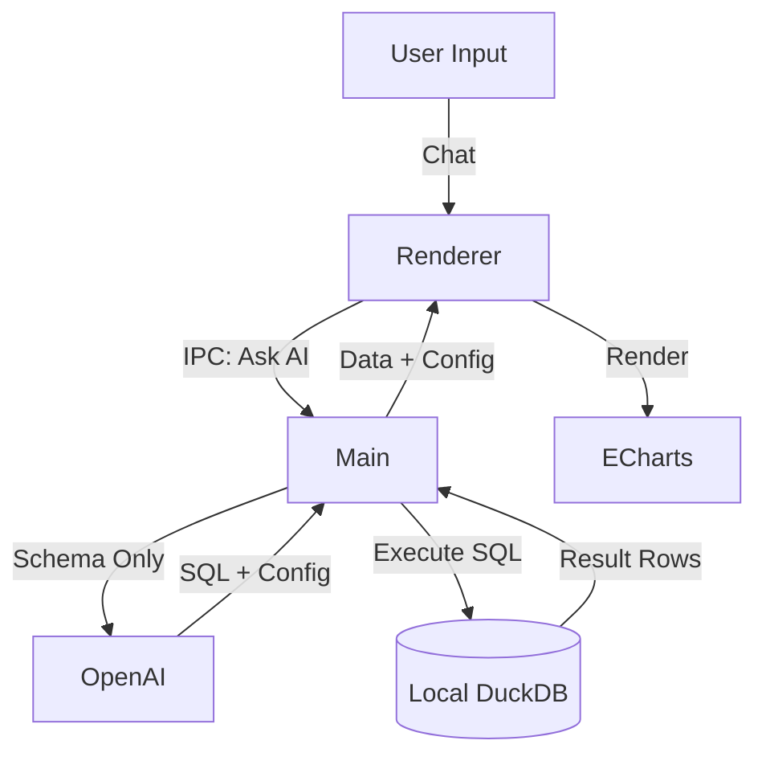

# Wansan Studio (万三) - Developer Context

## Project Overview
**Wansan Studio** is a local-first, privacy-focused Business Intelligence (BI) desktop application. It empowers users (SME owners, finance, operations) to generate visualizations and reports from Excel/CSV data using natural language, without uploading their sensitive data to the cloud.

*   **Core Philosophy:** "Data into Wealth, Privately."
*   **Key Mechanism:** Data is loaded into a local **DuckDB** instance. The AI (OpenAI) is *only* sent the table **schema** to generate SQL queries. The SQL is executed locally, and results are rendered via **ECharts**.

## Tech Stack

### Core
*   **Runtime:** Electron (Main + Renderer architecture)
*   **Language:** TypeScript
*   **Build Tool:** Vite (Renderer) + tsup (Main)

### Frontend (Renderer)
*   **Framework:** React 19
*   **State Management:** Zustand + TanStack Query v5
*   **Routing:** TanStack Router
*   **UI System:** Tailwind CSS v4 + ShadcnUI (Radix Primitives) + Lucide Icons
*   **Visualization:** ECharts (echarts-for-react)
*   **Data Grid:** TanStack Table v8

### Backend (Main Process)
*   **Database:** DuckDB (Node.js bindings) - Embedded OLAP database
*   **File I/O:** fs-extra
*   **IPC:** Secure context bridge pattern

## Architecture & Data Flow

### Key Directories
*   `src/main/`: Electron main process (DB logic, file handling, window management).
*   `src/renderer/`: React frontend application.
    *   `components/`: Reusable UI components.
    *   `stores/`: Zustand stores (`useChatStore`, `useWorkbenchStore`).
    *   `hooks/`: Custom hooks (`useAI`, `useIPC`).
*   `src/preload/`: Context bridge scripts.
*   `src/shared/`: Types and utilities shared between processes.

## Development Workflow

### Scripts
*   **Start Dev Server:** `npm run dev` (Starts Vite and Electron concurrently)
*   **Build Production:** `npm run build`
*   **Package App:** `npm run dist` (Uses electron-builder)
*   **Lint:** `npm run lint`
*   **Format:** `npm run format` (Prettier)

### Conventions
*   **Styling:** Use Tailwind CSS utility classes. Avoid CSS files unless global.
*   **State:** Use `zustand` for global app state (user prefs, file list), `TanStack Query` for async data (SQL results).
*   **Async/IPC:** All main process communication goes through `window.electron` API defined in `preload/index.ts`.
*   **I18n:** Support English (`en`) and Chinese (`zh`) via `i18next`.

## Privacy Rules (CRITICAL)
1.  **NEVER** send row data (values) to the LLM. Only send column names (schema) and types.
2.  **NEVER** log raw SQL results to external services.
3.  **Local Execution:** All data processing happens in the embedded DuckDB instance.

## Current Status (MVP)
*   Supports Excel/CSV upload.
*   Chat interface for "Text-to-SQL".
*   Basic Dashboard/Report generation.
*   PDF Export.
