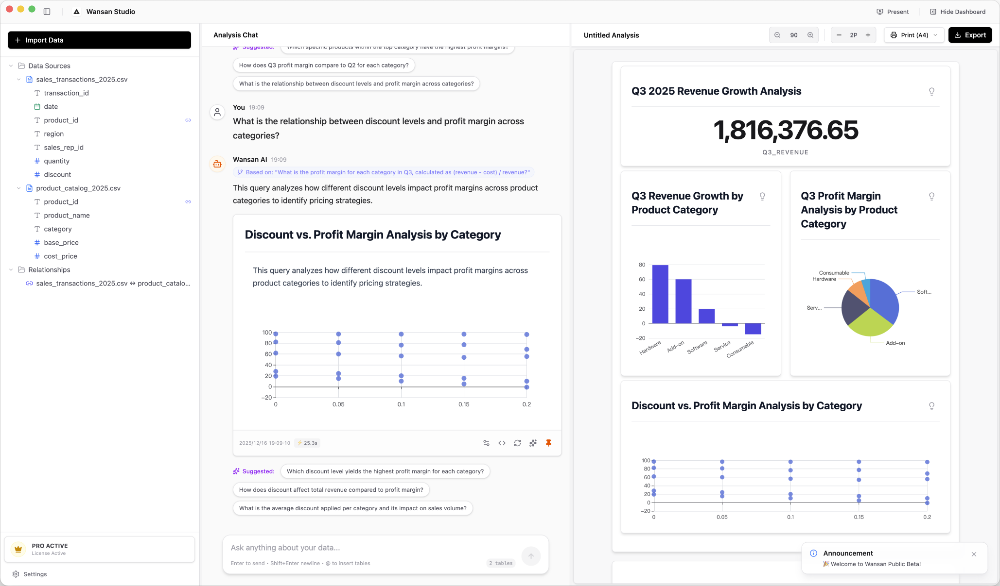
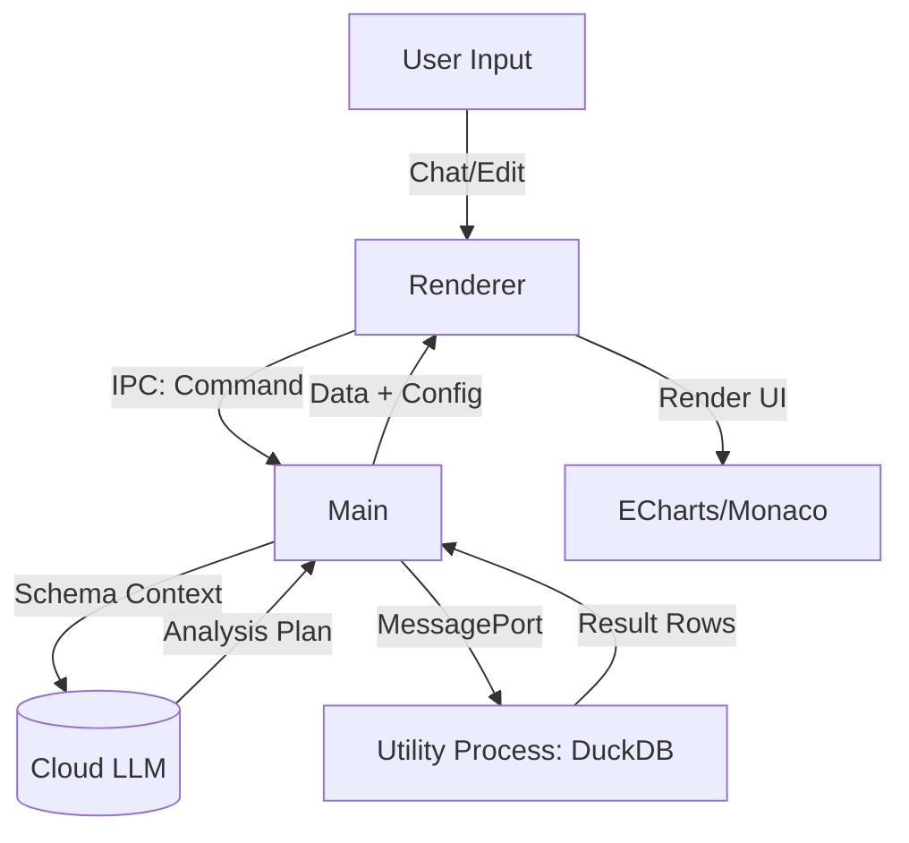

# 🚀 Wansan Studio (万三)

> **"数据聚宝，日进斗金。"**  
> **"Wansan - Turn Data into Wealth, Privately."**

[](https://studio.wansan.app)
[](https://opensource.org/licenses/MIT)
[](CONTRIBUTING.md)

🌐 **官方网站**: [https://studio.wansan.app](https://studio.wansan.app)

**万三 (Wansan Studio)** 是一款由 AI 驱动的 **本地优先 (Local-First)** 智能商业分析桌面应用。它允许用户通过自然语言，让 AI 对本地 Excel/CSV 数据进行极速分析并生成精美的商业图表。最重要的是：**原始数据永远不会离开你的设备**。

<p align="center">
  
</p>

---

## ✨ 为什么选择万三？

- 🔒 **隐私至上 (Privacy First)**：采用“Schema-Only”协议，你的原始明细数据保留在本地硬盘中，只会将表结构等元数据发送给 AI（如 OpenAI），绝不会泄露商业机密。
- ⚡ **极速分析 (Zero Latency)**：应用内嵌强悍的 **DuckDB** 作为本地数据引擎，支持毫秒级、海量行级数据的即时聚合。
- 🔑 **完全掌握权 (Ownership)**：真正的“自带密钥” (BYOK) 机制——你的数据资源、所有的报告产生结果与所应用的 API Key 完全保留在你自己的手中。

---

## 🎯 核心功能

* **🧠 智能查询 (AI-to-SQL)**
  自然语言驱动报表生成。内置自纠错闭环 (Auto-Fix Loop)，如果生成的 SQL 报错，会自动喂还给 AI 自我修正，极大提高可用性。
* **📊 交互式洞察表达 (Interactive Storytelling)**
  * **AI 洞察**: 基于数据结果自动分析出汇总摘要、核心发现与改进建议。
  * **视觉锚点 (Visual Anchoring)**: 鼠标悬浮在分析文本上时，图表会自动高亮相应的折线、切片或柱体。
* **💡 智能分析实验室 (Smart SQL Lab)**
  具有上下文与字段补全提示的 Monaco SQL 编辑器，用户可以直接干预 AI 生成的内容或者自定义报表视图。
* **📦 报表独立导出 (Web Export)**
  能够将生成的报表组合流“一键导出”为 **具备交互能力的独立 HTML 文件**（内联渲染引擎与数据快照），方便向整个团队无缝分发。

---

## 🛠️ 技术栈

* **核心框架**: Electron (为主进程、渲染进程和独立 DuckDB Utility Process 提供通信调度)
* **前端渲染**: React 18 + Vite + TypeScript + Zustand + TanStack Router/Query
* **UI/UX系统**: Tailwind CSS v4 + Shadcn UI + Wansan Airy（定制视觉语言）
* **数据库基座**: [@duckdb/node-api](https://duckdb.org/) (Native C++ Bindings) 
* **报表渲染**: Apache ECharts 
* **本地解析**: ExcelJS + fs-extra

---

## 🚀 快速开始

### 1. 环境准备
确保你的本地安装了 `Node.js` (建议 v20+。注：由于使用了 duckdb native bindings ，部分环境下可能需要本地支持 C++ 编译环境或构建工具)。

### 2. 克隆项目 & 安装依赖
```bash
git clone https://github.com/wansanai/wansan-studio.git
cd wansan-studio
npm install
```

### 3. 配置环境变量
在打包或运行之前，你需要准备你使用的 LLM 的 API 配置。
根据 `.env.example`，在根目录下创建 `.env` 文件并填入相关参数：
```bash
cp .env.example .env
```

### 4. 运行 & 构建
**开发模式 (热重载)**：
```bash
npm run dev
```

**打包构建 (生产环境)**：
```bash
npm run dist:mac     # Mac x64 环境构建
# 或
npm run dist:mac:all # Mac 双架构构建
# 或
npm run dist:win     # Windows 环境构建
```

---

## 🏗️ 架构概览



**设计哲学：Sidecar (边车) 模式隔离性能损耗**
我们通过 Electron 建立了一个专有的 Utility Process，来将 DuckDB 重型数据聚合操作完全剥离在主渲染 UI 之外，确保在亿级查询下前端依然能够呈现高达百帧的响应性能。

---

## ☕ 赞助与打赏 (Donate)

如果您觉得 **Wansan Studio (万三)** 节省了您的时间，对您的分析决策有所帮助，欢迎请我喝杯咖啡 ☕️，这将是维持项目持续迭代更新的最大动力！

<p align="center">
  
  
</p>

---

## 🤝 参与贡献

我们欢迎并感谢所有的代码贡献、Bug 反馈及特性分享！详细操作请参阅 [贡献指南 (CONTRIBUTING.md)](CONTRIBUTING.md)。

- 提交流程推荐使用统一的代码检查：`npm run lint:fix` 和 `npm run type-check`。
- 本应用的设计哲学和开发指导已收录在 `GEMINI.md` 与 `AGENTS.md` 中，供参考使用。

---

## 📄 用户免责声明与安全申明

使用本应用需自备合规的 AI 大语言模型 API Key 开发接口。对于 AI 产生幻觉导致错误所带来的商业决策损失，开发者不承担法律和连带责任。具体详情请参阅 [DISCLAIMER.md](DISCLAIMER.md)。

## 📜 协议 (License)

This project is licensed under the **MIT License** - see the [LICENSE](LICENSE) file for details.
