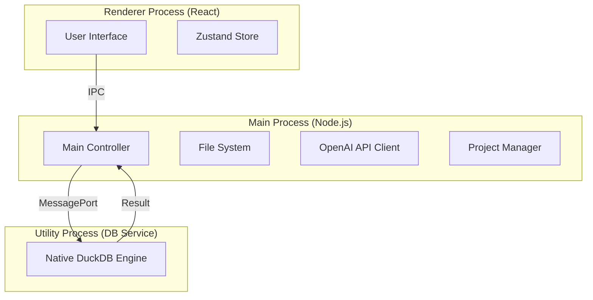

# 📘 00_ARCHITECTURE.md - System Overview & Core Patterns

> **Version**: 1.0 (Post-MVP Consolidation)
> **Status**: Authoritative / Stable
> **Scope**: High-level Architecture, Tech Stack, Process Model, Security.

---

## 1. Project Vision (愿景)

**Wansan (万三)** 是一款 **本地优先 (Local-First)** 的智能商业分析桌面软件。它旨在填补 Excel 与专业 BI 工具之间的鸿沟，让非技术人员通过自然语言对话，在不泄露数据隐私的前提下，快速生成专业级的商业报表。

### 1.1 Core Principles (核心原则)
1.  **Privacy First (隐私至上)**: 原始数据行 (Rows) 永远锁定在用户本地设备，仅 Schema (元数据) 用于 AI 推理。
2.  **Zero Latency (零延迟)**: 利用本地算力 (Local Compute) 进行数据处理，秒级响应大文件分析。
3.  **Ownership (所有权)**: 用户拥有数据、API Key 和生成的报告文件。

---

## 2. Technology Stack (技术栈)

我们采用了 **Electron + React + WASM** 的混合架构，以平衡开发效率、性能与跨平台稳定性。

### 2.1 App Shell (主进程)
*   **Runtime**: **Electron** (v39+ recommended for stability).
*   **Language**: TypeScript (Node.js environment).
*   **Build Tool**: `electron-builder` (supporting ASAR unpack for WASM).

### 2.2 Data Engine (数据引擎)
*   **Database**: **DuckDB Native** (`@duckdb/node-api`).
    *   *Mode*: **Native Process**.
    *   *Reasoning*: v1.3 迁移至 Native 绑定，以支持本地文件持久化 (`.duckdb`)、大文件流式读取和多线程性能。运行于独立的 `Utility Process` 以保证主进程稳定。
*   **Ingestion**: `ExcelJS` (Stream) + `fs-extra` + DuckDB `read_csv_auto`.

### 2.3 Frontend (渲染进程)
*   **Framework**: **React 18** + **Vite**.
*   **UI System**: **Tailwind CSS** + **Shadcn UI** (Radix Primitives).
*   **State Management**:
    *   **Zustand**: 全局应用状态 (UI, Layout, Metadata).
    *   **TanStack Query**: 异步任务管理 (AI Request, SQL Execution).
*   **Visualization**: **Apache ECharts** (Canvas rendering).
*   **Layout Engine**: `react-resizable-panels` (分栏) + `react-grid-layout` (看板拖拽).

---

## 3. Process Architecture (进程架构)

Wansan 遵循 **Sidecar 模式**，将繁重的数据库任务隔离。



### 3.1 IPC Communication Pattern
*   **Render -> Main**: 仅发送 **指令** (e.g., `executeSQL`, `analyzeFile`)。
*   **Main -> Render**: 返回 **纯 JSON 数据**。
*   **Security**: 启用 `contextIsolation: true` 和 `nodeIntegration: false`。

---

## 4. UI Framework: The Analyst Workbench (工作台架构)

我们摒弃了传统的 Chatbot 布局，采用了专业的 **三栏式工作台 (3-Column Workbench)** 设计。

### 4.1 Layout Structure
```text
[ Sidebar (250px) ]  |  [ Chat Stream (450px) ]  |  [ Dashboard Canvas (Flex) ]
-------------------  |  -----------------------  |  ---------------------------
- Project Data       |  - Interaction            |  - Deliverable Results
- File Tree          |  - Logic Reasoning        |  - Grid Layout (RGL)
- Schema Editor      |  - Intermediate Charts    |  - A4 / Screen Mode
```

### 4.2 View Modes
1.  **Draft Mode (Chat Focused)**: 用户在中间栏探索数据，右侧看板可折叠。
2.  **Dashboard Mode (Result Focused)**: 右侧看板全屏，中间栏折叠，用于演示或排版。

---

## 5. Persistence Strategy (持久化策略)

v1.3 引入了 **Project Bundle (`.wansan`)** 架构，实现了真正的本地持久化。

### 5.1 The Bundle
*   **Path**: 用户指定目录 (e.g., `~/Documents/MyAnalysis.wansan`).
*   **Content**:
    *   `source.duckdb`: 包含所有表数据和视图的物理数据库文件。
    *   `wansan.json`: 项目元数据 (Manifest)。
    *   `session.json`: UI 状态 (Layout, Chat History)。

### 5.2 Startup Sequence (启动保护)
*   **Race Condition Fix**: 引入 `isProjectLoaded` 瞬态标志。
*   **Flow**:
    1.  App 启动。
    2.  `useProjectInit` 检测上次路径 -> 调用 `openProject`。
    3.  Backend 连接 `source.duckdb`。
    4.  Frontend 收到 `success` -> 设置 `isProjectLoaded = true`。
    5.  此时才允许 `useDataRehydrate` 等组件查询数据库。

---

## 6. Security & Privacy (安全与隐私)

### 6.1 Schema-Only Protocol
*   **Rule**: 严禁将 `SELECT *` 或具体数据行发送给 LLM。
*   **Implementation**: Prompt 仅包含 `Table Name`, `Column Name`, `Column Type`。

### 6.2 BYOK (Bring Your Own Key)
*   **Policy**: Wansan 不提供内置 AI 服务。用户必须在设置中配置自己的 OpenAI/DeepSeek API Key。
*   **Storage**: API Key 存储在本地 `electron-store` (加密文件)，不经过我们的服务器。

### 6.3 Network Sandbox
*   **Whitelist**: Electron 仅允许连接到用户配置的 AI Endpoint (e.g., `api.openai.com`)。所有其他外部请求（除 License 验证）均被拦截。
