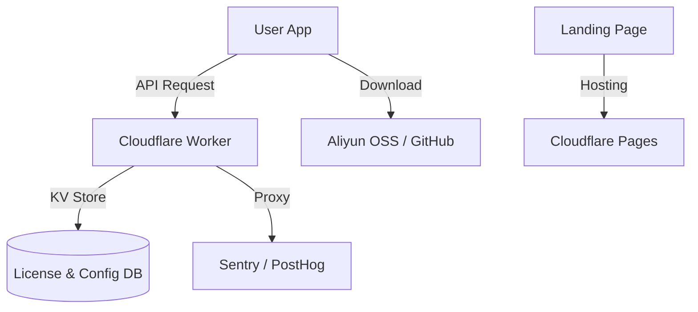

这是一份完整的 **Wansan (万三) 商业化与运维架构白皮书**。它整合了我们刚才讨论的所有决策点：**Cloudflare 基建**、**混合支付**、**安全验证** 以及 **全球化适配**。

这份文档将是您接下来进行 **"Ops & Business"** 阶段开发的执行手册。

请保存为 `docs/PLAN_OPERATIONS.md`。

---

# 🌏 PLAN_OPERATIONS.md - Commercialization & Operations Strategy

> **Version**: 1.0 (Draft)
> **Goal**: From "Code" to "Cash". Zero-cost infrastructure, global compliance, localized experience.

---

## 1. Infrastructure: The "Zero-Cost" Cloud (云端基建)

我们利用 **Cloudflare (CF)** 提供的免费层级服务构建无服务器后端，实现极低成本运维。

### 1.1 Architecture

### 1.2 Components
*   **API Gateway**: `api.wansan.app` (CF Worker)
    *   **职责**: License 验证、远程配置 (Feature Flags)、埋点转发。
    *   **部署**: 绑定自定义域名，开启 Proxy (小黄云) 以通过国内网络检查。
*   **Database**: **Cloudflare KV** 或 **D1**。
    *   **Schema**: `licenses` (Key -> DeviceID, Status), `config` (Global settings).
*   **Web Hosting**: **Cloudflare Pages**。
    *   部署静态官网。

---

## 2. Licensing & Security (授权与安全)

采用 **"在线心跳 + 离线宽容"** 的混合验证模式，结合 **Device Fingerprint** 防止滥用。

### 2.1 Identity (设备指纹)
*   **Library**: `node-machine-id`.
*   **Logic**: 获取硬件 ID 的 Hash，作为 `device_id`。
*   **Constraint**: 一个 License Key 最多绑定 2 台设备（可配置）。

### 2.2 Verification Flow (验证流)
1.  **Activate**: User inputs Key -> API `POST /activate`.
    *   Server checks KV. If valid & under limit -> Bind `device_id` -> Return `success`.
2.  **Startup**: App reads local Key.
    *   **Network Available**: API `POST /heartbeat`.
    *   **Network Unavailable**: Check local `expiry_date` & signature (Phase 2 feature). Allow entry (Grace Period).
3.  **Enforcement**:
    *   AI Bridge 模块在调用 OpenAI 前，检查内存中的 `license_status`。

### 2.3 Code Signing (签名)
*   **Strategy**: **Bypass (Strategy B)**.
*   **Mac**: 不购买 $99 证书。在下载页显著位置提供 `sudo xattr -cr` 修复命令教程。
*   **Win**: 接受 SmartScreen 蓝窗警告，引导用户点击 "Run Anyway"。

---

## 3. Payments: Dual-Track Strategy (双轨支付)

针对国内外支付习惯差异，实行 **分流策略**。

### 3.1 Global (International)
*   **Provider**: **Lemon Squeezy**.
*   **Integration**: Payment Link (Hosted Checkout).
*   **Flow**: User buys -> Email receives Key -> User activates in App.
*   **Pros**: Handles global tax (VAT), Apple Pay, PayPal.

### 3.2 China (Domestic)
*   **Provider**: **面包多 (Mianbaoduo)** / **爱发电** (或私域微信).
*   **Integration**: Direct Link.
*   **Flow**: User pays (WeChat/Alipay) -> Platform auto-delivers Key.
*   **Pros**: Familiar UX, low fees.

### 3.3 License Sync
*   **Unified DB**: 无论是 Lemon Squeezy 还是 面包多，生成的 Key 都必须**手动或自动同步**到您的 Cloudflare KV 中。
    *   *Auto*: 配置 Webhook，当 Lemon Squeezy 产生订单时，自动调用 Worker 写入 KV。
    *   *Manual*: 批量生成 Key，分别导入两个平台。

---

## 4. Distribution & Updates (分发与更新)

### 4.1 Download Sources
*   **Global**: **GitHub Releases** (Free, fast outside China).
*   **China**: **Aliyun OSS / Tencent COS** (Pay-as-you-go).
    *   *Cost*: ~¥10/month for start-up traffic.
    *   *Reason*: Essential for user retention. GitHub is too slow.

### 4.2 Auto-Update Logic
*   **Electron-Updater**:
    *   **Global Config**: Standard GitHub provider.
    *   **China Config**: Custom `generic` provider pointing to `https://updates.wansan.app/latest.yml` (which redirects to OSS).
*   **Switching**: App detects locale/IP on first run, selects update channel. (Or simply use OSS globally if budget allows).

---

## 5. Telemetry (埋点与日志)

### 5.1 Privacy-First Analytics
*   **Tools**: **PostHog** (Usage), **Sentry** (Crash).
*   **Proxy**: All requests go through `api.wansan.app/ingest` -> Worker -> PostHog.
    *   *Why*: Avoids ad-blockers and China firewall. Hides real backend.
*   **Data Scrubbing**:
    *   Strictly filter out `file_names`, `column_names`, `sql_content`.
    *   Only track: `event: "report_generated"`, `latency: 1200ms`, `error_type: "duckdb_crash"`.

---

## 6. Execution Roadmap (Next Steps)

1.  **Task N (Client)**: Integrate `node-machine-id` and implement the "License Store".
2.  **Task M (Cloud)**: Deploy Cloudflare Worker (Hello World).
3.  **Task O (Web)**: Build a simple Landing Page on CF Pages.

**(End of Operations Plan)**
