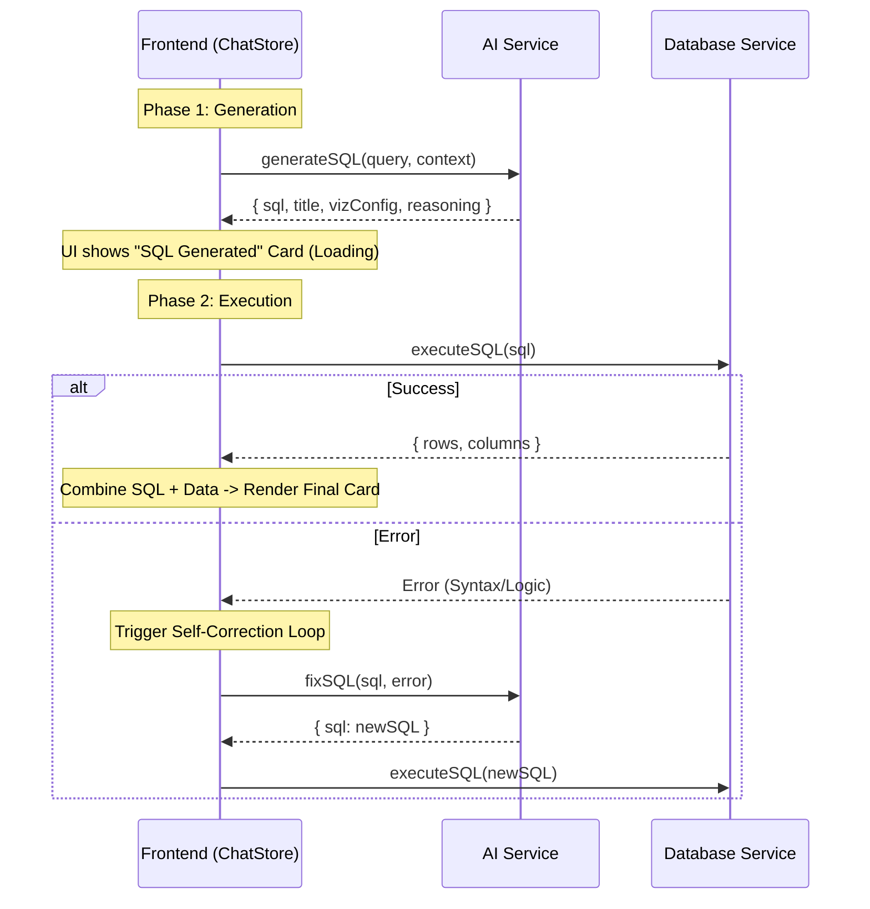

# 🧠 Spec: Two-Phase AI Flow (Privacy First)

> **Goal**: Visually separate "AI Generation" (Remote) from "Data Execution" (Local) to build user trust.
> **Architecture**: Frontend Orchestration (Saga-like flow).

## 1. The New Flow



## 2. Backend Refactor (`src/main/services/ai.ts`)

Split the monolithic `getAnalysis` into two atomic methods.

### 2.1 `generatePlan` (AI Only)
*   **Input**: User Query, Schemas, Context.
*   **Action**: Calls OpenAI.
*   **Output**: `AIAnalysisResult` (BUT `data` and `columns` are undefined).
*   **Risk**: Zero (No local data access).

### 2.2 `executePlan` (DB Only)
*   **Input**: SQL String.
*   **Action**: Calls DuckDB.
*   **Output**: `{ data: any[], columns: string[] }`.
*   **Risk**: High (Execution).

## 3. Frontend Orchestration (`use-chat-store.ts`)

The Store now needs a more complex state machine for the "Pending Message".

### State Machine
*   `idle`: Ready.
*   `thinking`: Sending query to AI.
*   `planning`: SQL received, waiting to execute (or executing).
*   `rendering`: Data received, rendering chart.
*   `error`: Failed after retries.

### Implementation Logic
```typescript
async function sendMessage(text) {
  // 1. Add User Message
  // 2. Add "Ghost" Bot Message (Status: 'thinking')
  
  try {
     // PHASE 1
     const plan = await api.ai.generatePlan(text, context);
     updateGhostMessage({ 
       status: 'planning', 
       sql: plan.sql, 
       reasoning: plan.reasoning 
     });
     
     // PHASE 2 (Automatic, or Manual if we add a 'Run' button later)
     const result = await api.db.executeQuery(plan.sql);
     
     // FINISH
     updateGhostMessage({
       status: 'success',
       data: result.data,
       columns: result.columns,
       // ... merge other props
     });
     
  } catch (err) {
     // Handle Retry / Error state
  }
}
```

## 4. UI Updates (`message-bubble.tsx`)

When `status === 'planning'`, show a specific **"Thinking Process" UI**:
*   Icon: 🧠 -> ⚡
*   Content: "Generated SQL..." (Show snippet of SQL).
*   Animation: Pulse effect indicating "Local Execution in progress".
