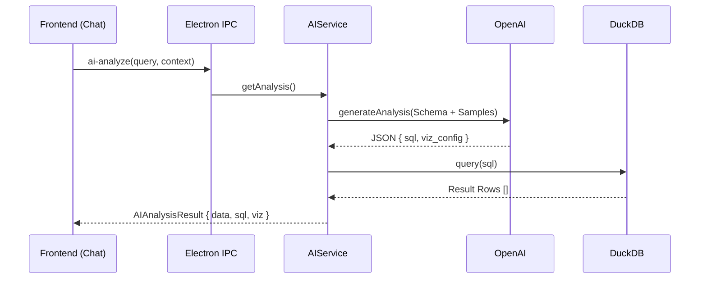

# 🧠 Spec: AI Core Engine V2

> **Version**: 2.0 (Direct Integration)
> **Date**: 2025-12-10
> **Scope**: AI Bridge, Prompt Engineering, Execution Pipeline.

## 1. Architecture: The "Generate-Execute" Pipeline

In V2, the AI Service is no longer just a text generator. It is an **Autonomous Analyst**.
The frontend calls `ai.analyze()`, and the backend returns **Data + Config**.



---

## 2. Data Structures (`src/shared/types.ts`)

### 2.1 The Unified Result
We abandoned the split between `AnalysisResult` and `QueryResult`.

```typescript
export interface AIAnalysisResult {
  status: 'success' | 'error';
  
  // 1. Data Layer (The "Meat")
  data?: any[];        // The raw rows from DuckDB
  columns?: string[];  // Header names
  sql?: string;        // The executed SQL

  // 2. Narrative Layer (The "Brain")
  title?: string;      // Report Title (e.g., "Monthly Sales Trend")
  summary?: string;    // Business Insight
  reasoning?: string;  // Technical Explanation
  suggestions?: string[]; // Next Question Prompts

  // 3. Visualization Layer (The "Face")
  visualization?: {
    type: 'bar' | 'line' | 'pie' | 'scatter' | 'table' | 'kpi';
    config: {
      x_axis?: string | null;
      y_axis?: string | string[] | null; // Supports multi-series
      series_name?: string;
    };
  };
  
  error?: string;
}
```

---

## 3. Prompt Engineering Strategy

### 3.1 System Prompt (V2)
Key changes: Expanded Viz Types, strict JSON rules.

```text
### VISUALIZATION RULES
1. AUTO-DETECT CHART:
   - Time Series -> 'line'
   - Comparison -> 'bar'
   - Part-to-Whole -> 'pie'
   - Correlation -> 'scatter'
   - Big Number -> 'kpi'
   - List -> 'table'

2. CONFIG:
   - y_axis: String (single) or Array (multi-series).
```

### 3.2 Schema Context Injection (The Secret Sauce)
We do NOT just send column names. We send **Hints** and **Samples**.

**Format**:
```text
Table: "t_orders"
Columns:
- "amount" (DOUBLE) [Money/Metric] (Samples: 100.5, 20.0, 5000)
- "status" (VARCHAR) (Samples: "PAID", "PENDING", "FAILED")
```

**Why Samples?**
*   Helps AI infer "Categorical" vs "Free Text".
*   Helps AI understand ID formats for joins.

---

## 4. Service Implementation (`AIService`)

### 4.1 Dependency Injection
The `AIService` must hold references to:
1.  `OpenAI` Instance (Configurable).
2.  `DatabaseService` (For execution).

### 4.2 Error Handling & Self-Correction
*   **Level 1**: API Error (OpenAI down) -> Return `status: 'error'`.
*   **Level 2**: SQL Execution Error (DuckDB fail) ->
    *   *Plan*: Catch error, feed back to LLM with "Fix this SQL".
    *   *Limit*: Max 1 retry.

---

## 5. Configuration Management

*   **Store**: `electron-store` key `aiConfig`.
*   **Priority**:
    1.  User Settings (Store)
    2.  Env Vars (`OPENAI_API_KEY`)
    3.  Defaults (Hardcoded)
*   **Hot Reload**: Changing settings in UI immediately re-instantiates the OpenAI client in `AIService`.
