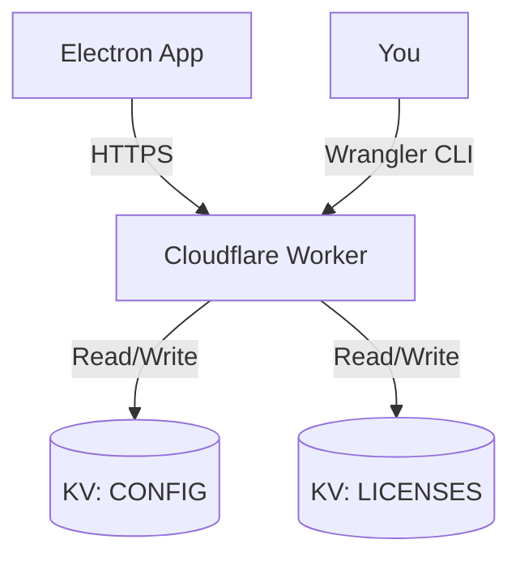

# ☁️ Spec: Cloud Infrastructure (Sprint 1)

> **Goal**: Establish the serverless backend using Cloudflare Workers & KV.
> **Repo**: `wansan-cloud` (New)
> **Stack**: TypeScript, Hono (Web Framework), Cloudflare KV.

## 1. Architecture Overview



*   **Endpoint**: `https://api.wansan.app`
*   **Runtime**: Cloudflare Workers (Edge).
*   **Cost**: Free Tier (100k requests/day), sufficient for <5000 DAU.

## 2. KV Namespaces Design

We need two distinct KV namespaces.

### 2.1 `WANSAN_CONFIG` (Global Settings)
Stores feature flags and version control.

*   **Key**: `global_settings`
*   **Value (JSON)**:
    ```json
    {
      "min_version": "1.0.0",
      "latest_version": "1.0.1",
      "beta_code": "WANSAN-BETA", // Dynamic Beta Code
      "maintenance_mode": false,
      "announcement": {
        "id": "welcome-beta",
        "text": "Welcome to Wansan Beta! Check Discord for help.",
        "link": "https://..."
      }
    }
    ```

### 2.2 `WANSAN_LICENSES` (License Database)
Stores user license states.

*   **Key**: `LIC_{license_key}` (e.g., `LIC_550e8400-e29b...`)
*   **Value (JSON)**:
    ```json
    {
      "status": "active", // active, suspended, refunded
      "plan": "pro_lifetime",
      "max_devices": 2,
      "activations": [
        { "device_id": "hwid_abc123", "activated_at": 1700000000 }
      ],
      "created_at": 1700000000,
      "email": "user@example.com" // Optional, for support
    }
    ```

## 3. API Endpoints (Hono Routes)

### 3.1 `GET /v1/config`
*   **Auth**: Public.
*   **Headers**: `X-App-Version`, `X-Platform`.
*   **Logic**:
    1.  Fetch `global_settings` from KV.
    2.  Check if `X-App-Version` < `min_version`. If so, inject `force_update: true`.
    3.  Return settings JSON.

### 3.2 `POST /v1/license/activate`
*   **Auth**: Public (Rate Limited).
*   **Body**: `{ "key": "...", "device_id": "..." }`.
*   **Logic**:
    1.  Check if Key exists in `WANSAN_LICENSES`.
    2.  Check status (`active`?).
    3.  Check device limit.
        *   If `device_id` already in `activations`, return success (Idempotent).
        *   If count < `max_devices`, add to `activations`, update KV, return success.
        *   Else, return Error 403 "Too many devices".

### 3.3 `POST /v1/license/heartbeat` (Keep-alive)
*   **Body**: `{ "key": "...", "device_id": "..." }`.
*   **Logic**:
    1.  Validate Key + Device match.
    2.  If Key was refunded/banned, return `{ "valid": false }` to lock the client.

## 4. Implementation Steps

1.  **Init**: `npm create hono@latest wansan-cloud`. Select `cloudflare-workers`.
2.  **KV Setup**:
    *   `wrangler kv:namespace create WANSAN_CONFIG`
    *   `wrangler kv:namespace create WANSAN_LICENSES`
    *   Update `wrangler.toml` with IDs.
3.  **Code**: Implement Hono routes.
4.  **Deploy**: `npm run deploy`.
