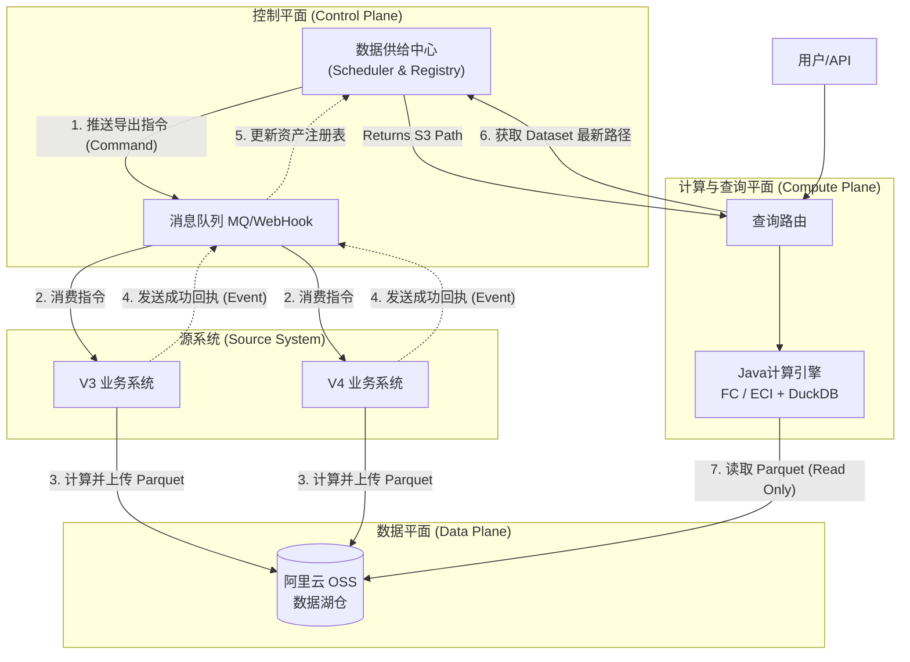
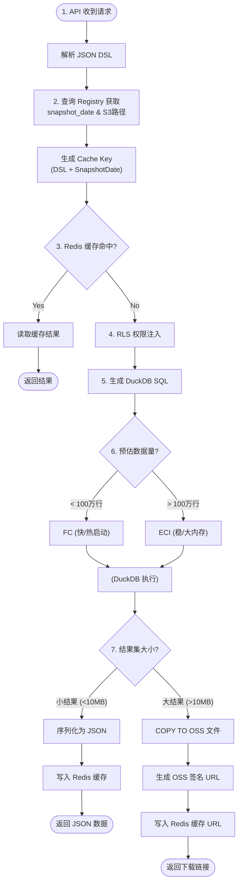

# 0. 报表平台技术架构设计预研

---

## 1. 项目概述 (Overview)

### 1.1 背景

公司运营一套面向 300+ 客户的 SaaS 平台，底层由 V3（.NET/MySQL/文件模型）和 V4（Java/PG/在线模型）两套异构系统组成。现需建设统一的报表数据平台，支持租户自定义报表。

### 1.2 核心目标

*   **统一数据出口**：屏蔽 V3/V4 差异，提供标准化的数据查询服务。
    
*   **租户自定义**：支持租户基于数据集（Dataset）进行灵活的报表定义（SQL/公式）。
    
*   **性能与成本平衡**：在 T+1 时效下，处理单表 2亿+ 行数据，利用 Serverless 架构降低成本。
    

### 1.3 关键技术约束

*   **数据模式**：**T+1 全量快照 (Full Snapshot)**，业务系统每日全量导出。**（基于职行力目前的业务特性， 如果能以增量方式效率上会更高）**
    
*   **开发语言**：**Java**。
    
*   **基础设施**：阿里云 (OSS/FC/ECI)，无跨云流量。
    
*   **核心引擎**：Serverless + DuckDB (Java JDBC)。
    

---

## 2. 总体架构设计 (System Architecture)

系统采用 **“逻辑数仓 (Logical Data Warehouse)”** 架构，核心理念为 **控制流与数据流分离**。

### 2.1 逻辑架构视图 

此视图清晰展示了 **DDC (数据供给中心)** 如何通过 MQ 主动驱动 **V3/V4** 进行数据生产的闭环流程。


---

## 3. 核心模块详细设计

### 3.1 模块一：数据供给中心 (Data Delivery Center)

**定位**：融合“任务调度”与“数据资产管理”，是平台的控制中枢。

#### 3.1.1 核心职责

1.  **任务编排**：根据租户订阅的报表，计算每日需导出的 Dataset 列表，并进行去重。
    
2.  **指令下发**：通过 MQ 主动向 V3/V4 发送导出指令（Topic: `cmd.export`）。
    
3.  **资产注册**：接收导出完成回执，更新 Dataset 的最新版本指针（Latest Pointer）。
    
4.  **生命周期治理**：自动清理 OSS 上过期的历史快照（如只保留最近 3 天）。
    

#### 3.1.2 数据库模型 (ERD)

*   `**dataset_definition**` **(资产定义)**：定义 Dataset 名称、所属系统、Schema。
    
*   *   `task_id` (UUID)
        
    *   `dataset_name`, `tenant_id`
        
    *   `snapshot_date` (快照日期)
        
    *   `status` (CREATED / **DISPATCHED** / SUCCESS / FAILED)
        
    *   `s3_path_prefix` (预设写入路径)
        
*   *   `dataset_id`
        
    *   `tenant_id`
        
    *   `current_snapshot_date` (当前可用日期)
        
    *   `latest_s3_path` (DuckDB 可读路径，如 `s3://.../*.parquet`)
        
    *   _查询引擎只读取此表获取数据地址。_
        

#### 3.1.3 交互流程详解

1.  **触发 (Trigger)**：DDC 的定时调度器（Quartz/XXL-Job）触发，生成任务记录。
    
2.  **下发 (Dispatch)**：DDC 将任务包装为 JSON，推送到 MQ。
    
3.  **执行 (Execute)**：V3/V4 监听 MQ，执行全量计算并上传 OSS。
    
4.  **注册 (Register)**：V3/V4 回调 MQ，DDC 更新 Registry 表。
    

---

### 3.2 模块二：计算与查询引擎 (Query Engine)

**定位**：基于 Java + DuckDB 的 Serverless 执行单元。

#### 3.2.1 关键技术栈

*   **Language**: Java 17+
    
*   **Lib**: `org.duckdb:duckdb_jdbc`
    
*   **SQL Builder**: EQL
    
*   **Host**: Docker (Local POC) -> Alibaba Cloud FC/ECI
    

#### 3.2.2 逻辑处理流程 (补充修订版)

在原有的流程中，我们需要在“元数据解析”之后插入“缓存检查”，并在“执行”之后插入“缓存写入”。

1.  **Request Parsing (请求解析)**:
    
    *   接收 JSON DSL。
        
    *   解析出 `tenant_id`, `dataset_name`, 维度, 度量, 过滤条件。
        
2.  **Metadata Resolution (元数据解析 & 版本锁定)**:
    
    *   查询 `dataset_registry` 获取该数据集的 `**current_snapshot_date**` (关键！缓存 Key 必须包含数据版本日期，防止返回旧数据)。
        
3.  **Cache Check (缓存检查)**:
    
    *   **生成 Cache Key**: `MD5(tenant_id + dataset_name + snapshot_date + JSON_DSL_Hash)`。
        
    *   **查询 Redis**: 检查是否存在缓存结果。
        
    *   **命中 (Hit)**: 直接返回缓存的 JSON 数据，**结束流程**。
        
    *   **未命中 (Miss)**: 继续后续流程。
        
4.  **Security Injection (RLS 注入)**:
    
    *   读取当前用户上下文。
        
    *   强制在 WHERE 子句中追加租户和权限过滤条件（如 `AND dept_code = 'A'`）。
        
5.  **SQL Generation (SQL 生成)**:
    
    *   将逻辑表名替换为物理函数：`FROM read_parquet('s3://...')`。
        
6.  **Smart Routing (智能路由)**:
    
    *   FC 模式：数据量 < 100万行 且 非复杂 Join。响应快，成本低。
        
    *   ECI 模式：数据量 > 100万行 或 复杂计算。资源足，稳定性高。
        
7.  **Execution & Result Handling (执行与结果处理 - 修改步骤)**:
    
    *   DuckDB 执行查询。
        
    *   **结果集大小判断**:
        
        *   **小结果集 (< 10MB)**:
            
            *   序列化为 JSON。
                
            *   **写入 Redis**: 设置 TTL (如 30分钟)。
                
            *   返回 JSON 给 API。
                
        *   **大结果集 (> 10MB 或 导出请求)**:
            
            *   DuckDB 直接写出文件到 OSS (`COPY ... TO 's3://tmp/...'`).
                
            *   **写入 Redis**: 缓存值为 OSS 下载链接 (Signed URL)。
                
            *   返回 URL 给 API。
                



### 关键设计点说明

1.  **缓存键 (Cache Key) 的版本化**：
    
    *   必须将 `snapshot_date` 加入到 Redis Key 中。
        
    *   _场景_：今天 (T) 用户查了一次，缓存了。今晚数据更新了 (T+1)，`snapshot_date` 变了，生成的 Key 自然变了。用户明天查询时，自动穿透缓存查最新数据，旧缓存自动过期。**无需手动清除缓存。**
        
2.  **大结果集不进 Redis**：
    
    *   Redis 存储大 Value 性能极差且贵。
        
    *   对于大结果（通常是明细导出），策略是“缓存下载链接”，而不是“缓存数据本身”。
        

#### 3.2.3 Java 内存管理规范 (Critical)

由于 DuckDB 使用堆外内存（Native Memory），必须严格限制 JVM 堆大小。

*   **容器规格示例**：4GB 内存
    
*   **JVM 参数**：`-Xmx512m` (限制 Java 堆，留出空间)
    
*   **DuckDB 初始化 SQL**：
    

---

## 4. 接口与数据规范 (Interface & Data Specification)

### 4.1 物理存储与文件规范 (Storage & File Spec)

所有数据必须存储在阿里云 OSS 上，且必须兼容 S3 API 协议以便 DuckDB 读取。

#### 4.1.1 目录结构 (Directory Structure)

采用 **Hive-Partitioning** 风格，目录名即分区键，DuckDB 可利用此结构进行分区剪枝 (Partition Pruning)。

*   **路径模板**: `oss://<bucket_name>/<env>/data/tenant_id=<tenant_id>/dataset=<dataset_name>/snapshot_date=<yyyy-MM-dd>/`
    
*   **路径变量说明**:
    
    *   `<env>`: 环境隔离，如 `prod`, `staging`, `dev`。
        
    *   `<tenant_id>`: 租户唯一标识 (String)。
        
    *   `<dataset_name>`: 数据集英文标识 (Snake Case, e.g., `user_exam_log`)。
        
    *   `<yyyy-MM-dd>`: 快照日期 (e.g., `2026-01-09`)。
        

#### 4.1.2 文件格式 (File Format)

*   **格式**: **Parquet** (Version 2.0+)
    
*   **压缩算法**: **Snappy** (默认) 或 **Zstd**。
    
    *   _说明_: Snappy 读写速度最快，适合 Serverless 高频读取；Zstd 压缩率更高。建议优先使用 Snappy 以降低 CPU 解压开销。
        
*   **文件命名**: `part-<uuid>.parquet`
    
*   **文件大小**: 建议单个文件控制在 **128MB ~ 512MB** 之间。
    
    *   _禁止_: 数万个几 KB 的小文件 (会导致 OSS 请求费用激增且拖慢 List 操作)。
        
    *   _禁止_: 单个 10GB 的大文件 (会导致 DuckDB 并行度失效)。
        

#### 4.1.3 完成标识 (Completion Marker)

*   **标识文件**: `_SUCCESS`
    
*   **说明**: 只有当该 dataset 下的所有 Parquet 分片都上传成功后，业务系统才能上传此空文件。DDC 和 查询引擎以此文件作为“数据就绪”的原子性标志。
    

---

### 4.2 逻辑模型与 Schema 规范 (Schema Spec)

#### 4.2.1 字段类型映射表 (Type Mapping)

V3 (.NET) 和 V4 (Java) 导出时，必须将内部类型转换为标准的 Parquet 物理类型。

| 业务数据类型 (Java/V4) | 业务数据类型 (.NET/V3) | Parquet 物理类型 | 逻辑类型 (Annotation) | 说明 |
| --- | --- | --- | --- | --- |
| Integer / int | Int32 | **INT32** | \- | \- |
| Long / long | Int64 | **INT64** | \- | ID 类字段统一用 INT64 |
| Float / Double | Single / Double | **DOUBLE** | \- | 科学计算用 |
| BigDecimal | Decimal | **FIXED\_LEN\_BYTE\_ARRAY** | **DECIMAL(P,S)** | **金额/积分必须用此类型**，防止精度丢失 |
| String / Varchar | String | **BYTE\_ARRAY** | **UTF8** | \- |
| Date | DateTime | **INT32** | **DATE** | 存储天数 |
| Timestamp / Date | DateTime | **INT64** | **TIMESTAMP\_MILLIS** | **强制存储为 UTC 时间戳** |
| Boolean | Boolean | **BOOLEAN** | \- | \- |
| List / JSON | List / JSON | **BYTE\_ARRAY** | **UTF8** | 复杂结构转为 JSON 字符串存储 |

#### 4.2.2 强制系统字段 (Mandatory Fields)

每个 Parquet 文件内部，除了业务字段外，必须冗余包含以下字段（方便 DuckDB 不依懒路径元数据也能查询）：

| 字段名 | 类型 | 说明 |
| --- | --- | --- |
| `_tenant_id` | STRING | 租户 ID |
| `_snapshot_date` | DATE | 快照日期 |
| `_export_time` | TIMESTAMP | 数据导出的系统时间 (UTC) |

---

### 4.3 通信协议规范 (MQ/WebHook)

使用消息队列（RocketMQ）或 WebHook 进行异步交互。消息体采用 JSON 格式。

#### 4.3.1 导出指令 (Command)

*   **Topic**: `report.cmd.data.export`
    
*   **Sender**: DDC (Data Delivery Center)
    
*   **Receiver**: V3 / V4 System
    
*   **Payload**:
    

```json
{
  "protocol_version": "1.0",
  "task_id": "550e8400-e29b-41d4-a716-446655440000",
  "tenant_id": "1001",
  "dataset_name": "course_study_log",
  "snapshot_date": "2026-01-09",
  "target_config": {
    "bucket": "report-data-oss",
    "prefix": "prod/data/tenant_id=1001/dataset=course_study_log/snapshot_date=2026-01-09/"
  },
  "options": {
    "force_overwrite": true,
    "compression": "SNAPPY"
  }
}

```

#### 4.3.2 导出结果回执 (Event)

*   **Topic**: `report.evt.data.exported`
    
*   **Sender**: V3 / V4 System
    
*   **Receiver**: DDC
    
*   **Payload (成功时)**:
    

```json
{
  "task_id": "550e8400-e29b-41d4-a716-446655440000",
  "tenant_id": "1001",
  "dataset_name": "course_study_log",
  "snapshot_date": "2026-01-09",
  "status": "SUCCESS",
  "stats": {
    "file_count": 4,
    "total_rows": 204500,
    "total_size_bytes": 104857600,
    "duration_ms": 5400
  },
  "final_path": "oss://report-data-oss/prod/.../snapshot_date=2026-01-09/"
}

```

*   **Payload (失败时)**:
    

```json
{
  "task_id": "...",
  "status": "FAILED",
  "error": {
    "code": "ERR_DB_TIMEOUT",
    "message": "Source database query timed out after 600s",
    "retryable": true
  }
}

```
---

### 4.4 错误代码规范 (Error Codes)

V3/V4 在回传失败消息时，应使用标准错误码，以便 DDC 决定是否重试。

| 错误码 | 含义 | DDC 建议行为 |
| --- | --- | --- |
| `ERR_DB_TIMEOUT` | 业务库查询超时 | **立即重试** (Max 3次) |
| `ERR_OSS_UPLOAD` | OSS 上传失败 (网络/权限) | **立即重试** (Max 3次) |
| `ERR_OOM` | 业务系统内存溢出 | **延迟重试** (建议错峰) |
| `ERR_SCHEMA_MISMATCH` | 业务代码与数据定义不匹配 | **不重试**，报警人工介入 |
| `ERR_BUSINESS_BLOCK` | 业务逻辑主动拦截 (如租户欠费) | **不重试**，标记为 SKIPPED |

---

### 4.5 统一数据导出 SDK 规划 (Client SDK Roadmap)

为了降低接入成本并强制执行上述数据规范，报表平台架构组将负责提供标准化的 SDK。业务团队**禁止**自行手写 Parquet 生成逻辑或 MQ/WebHook 发送逻辑，**必须**调用 SDK。

#### 4.5.1 SDK 核心职责

1.  **Parquet 写入标准化**：自动处理 Java/C# 类型到 Parquet 物理类型的映射（如 Date -> Int32, Timestamp -> Int64 UTC）。
    
2.  **S3/OSS 传输封装**：内置分片上传、断点续传、AK/SK 管理。
    
3.  **MQ/WebHook 协议封装**：自动组装 Command/Event JSON，自动处理重试和 Ack。
    
4.  **目录规范强校验**：强制校验上传路径是否符合 `tenant_id=xxx/dataset=xxx` 结构，防止业务乱写目录。
    

#### 4.5.2 提供的 SDK 版本

| SDK 名称 | 语言 | 适用系统 | 核心依赖库 |
| --- | --- | --- | --- |
| `report-platform-sdk-java` | Java 17+ | V4 业务系统 | `org.apache.parquet:parquet-avro`<br>`aliyun-sdk-oss`<br>`rocketmq-client` |
| `ReportPlatform.SDK.Net` | .NET 6+ | V3 业务系统 | `Parquet.Net`<br>`Aliyun.OSS.SDK`<br>`RocketMQ.Client` |

#### 4.5.3 接口设计 (API Design Draft)

业务开发人员只需要写几十行代码即可完成一个数据集的导出。

**Java SDK 伪代码示例**:

```java
// 1. 初始化 Exporter (注入配置)
ReportExporter exporter = new ReportExporter(config);

// 2. 监听导出指令 (SDK 内部自动处理 MQ 监听)
exporter.onExportCommand((task) -> {
    
    // 3. 业务逻辑：查询数据库获取 ResultIterator (流式，防 OOM)
    Iterator<UserExam> dataStream = userService.queryExamLogs(task.getTenantId());

    // 4. 执行导出 (SDK 自动切分文件、上传 OSS、转换类型)
    ExportResult result = exporter.writeDataset(task)
        .schema(UserExam.class)  // 自动解析 Class 注解映射 Schema
        .data(dataStream)
        .execute();
        
    // 5. SDK 自动发送 MQ 成功回执
    return result; 
});

```

**.NET SDK 伪代码示例**:

```csharp
// 1. 初始化
var exporter = new ReportExporter(config);

// 2. 注册回调
exporter.OnExportCommand(async (task) => {
    
    // 3. 业务逻辑：获取 IDataReader 或 IEnumerable
    var dataReader = _db.ExecuteReader("SELECT * FROM UserExam WHERE ...");

    // 4. 执行导出
    var result = await exporter.WriteDatasetAsync(task)
        .WithSchemaFrom<UserExamDto>()
        .WithData(dataReader)
        .ExecuteAsync();
        
    return result;
});

```
---

## 5. 基础设施与运维 (Infra & Ops)

### 5.1 阿里云资源规划

*   **OSS**：标准存储类型。配置 Lifecycle Rule，自动删除 `snapshot_date` 早于 3 天前的数据对象。
    
*   **Function Compute (FC)**：
    
    *   Runtime: Custom Container (Java 17)。
        
    *   规格: 2GB ~ 4GB。
        
*   **ECI**：
    
    *   规格: 4 vCPU / 8GB Memory。
        
    *   挂载: 20GB 临时存储 (用于 DuckDB Spill)。
        

### 5.2 网络安全

*   所有组件部署在同一 VPC 内。
    
*   FC/ECI 通过 **VPC 内网端点** 访问 OSS，无需公网流量。
    
*   数据库（Registry）仅允许 VPC 内网 IP 访问。
    

---

## 6. POC 预研计划 (Immediate Actions)

基于本地 Docker 环境验证 Java + DuckDB 的可行性。

### 6.1 环境准备

*   **Docker Compose**: MinIO (模拟 OSS) + Java Container。
    
*   **Data**: 生成一份 2亿行的 Mock 数据 (Parquet 格式) 上传至 MinIO。
    

### 6.2 验证清单

1.  **JDBC 连接**：Java 代码能否成功加载 `duckdb_jdbc` 并连接 MinIO。
    
2.  **内存控制**：
    
    *   配置 `-Xmx` 和 `SET memory_limit`。
        
    *   验证 `temp_directory` 是否有临时文件生成 (Spill 机制是否生效)。
        
3.  **查询性能**：
    
    *   测试 `GROUP BY` 和 `COUNT(DISTINCT)` 在 2亿行数据下的耗时。