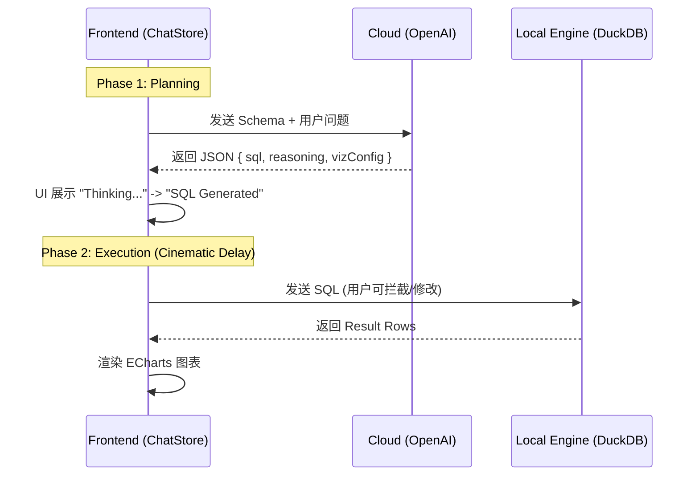

这里是 **Project Wansan 架构全书** 的第一部分整理。此部分聚焦于项目的核心地基，涵盖了愿景、UI 架构以及最关键的数据引擎演进。

---

# 📚 Book of Wansan: Part 1 - Core Foundation (核心架构)

## 1. Overview (项目综述)

**Wansan Studio (万三)** 是一款 **本地优先 (Local-First)** 的智能商业报表桌面端软件。它旨在解决中小企业数据隐私焦虑，通过“数据不出域”的方式，利用本地算力完成从 Excel 到交互式报表的转换。

### 1.1 核心价值 (Core Values)
*   **守财 (Privacy)**：基于 Electron + DuckDB 的本地闭环架构。仅将脱敏后的 Schema 发送给 LLM，原始数据行（Rows）永不上云。
*   **聚财 (Insight)**：自然语言驱动的分析体验 (Chat-to-Report)。
*   **生财 (Efficiency)**：极速冷启动，秒级处理 100MB+ Excel 文件。

### 1.2 技术栈选型 (Tech Stack)
*   **App Shell**: **Electron 28+** (主进程负责 I/O、窗口管理、打印)。
*   **Frontend**: **React 18 + Vite** (渲染进程)。
    *   **State**: Zustand (Store) + React Query (Async).
    *   **UI**: Tailwind CSS + Shadcn UI.
*   **Data Engine**: **DuckDB-WASM** (运行于 Node 环境的 In-Process OLAP 数据库)。
*   **AI Bridge**: OpenAI API (Schema-Only Mode).

---

## 2. UI/UX Framework (界面交互架构)

项目经历了从单纯的 "Chatbot" 到专业的 **"Analyst Workbench (分析师工作台)"** 的战略转型。

### 2.1 布局演进 (Layout Evolution)
最终确立为 **三栏式布局 (3-Column Layout)**，实现了“数据管理”、“分析探索”与“结果交付”的物理分离。

*   **Left (Data Assets)**: `250px` 固定宽度。
    *   **组件**: `DataTree` (基于 `react-arborist`)。
    *   **功能**: 文件管理、字段类型修正、关联关系查看。
*   **Middle (Interaction)**: `450px` (可折叠)。
    *   **组件**: `ChatStream`。
    *   **功能**: 也就是“草稿纸”。负责自然语言输入 (`MagicInput`)、中间态图表预览、错误自愈交互。
*   **Right (Deliverable)**: `Flex-1` (自适应)。
    *   **组件**: `DashboardCanvasV3`。
    *   **功能**: 也就是“成品区”。承载 Pinned Reports，支持网格拖拽 (`react-grid-layout`) 和 A4 分页模拟。

### 2.2 设计规范 (Design Specs)
*   **主题**: 极简主义 **Zinc/Black** 色系。强调数据的专业感，避免高饱和度色彩干扰（除了 Error/Success 状态）。
*   **组件库**: 深度集成 **Shadcn UI**。
    *   *定制点*: 修复了 `Toast` 在 Electron 中的层级问题；定制了 `MagicInput` 的悬浮胶囊样式。

---

## 3. Data Engine (数据引擎核心)

这是项目技术难度最高、迭代最剧烈的模块。

### 3.1 架构演进：从 Native 到 WASM
*   **Phase 1 (Native Binding)**: 最初使用 `duckdb` 原生 Node.js 绑定。
    *   *问题*: 遭遇严重的 `SIGSEGV` (内存越界) 和 `SIGABRT` (断言失败) 崩溃，且与 Electron 的 ABI 版本兼容性极差（导致 `electron-rebuild` 卡死）。
*   **Phase 2 (WASM Migration)**: 最终迁移至 **`@duckdb/duckdb-wasm`**。
    *   *决策依据*: 牺牲约 20% 的性能，换取 100% 的稳定性和跨平台兼容性（消除了 Native 编译痛点）。
    *   *实现细节*: 在 Electron 主进程中使用 `duckdb-node-blocking` 绑定，规避了 Node Worker 的复杂通信问题。

### 3.2 关键实现路径 (Key Implementation)

#### 数据库服务封装 (`src/main/services/database.ts`)
虽然底层换了，但上层通过 `DatabaseService` 保持了 API 统一。

```typescript
// 核心封装：确保 WASM 在 Node 环境下正确加载
import { createDuckDB } from '@duckdb/duckdb-wasm/dist/duckdb-node-blocking';

export class DatabaseService {
  private db: any = null;
  private conn: any = null;
  
  // 使用 Mutex 防止并发查询导致的 WASM 状态异常
  private mutex = new Mutex();

  async init() {
    // 手动解析 WASM bundle 路径（Electron ASAR 陷阱）
    const bundle = {
      mainModule: path.resolve(DUCKDB_DIST, './duckdb-mvp.wasm'),
      mainWorker: path.resolve(DUCKDB_DIST, './duckdb-node-mvp.worker.cjs'),
    };
    this.db = await createDuckDB({ mvp: bundle }, ...);
    this.conn = this.db.connect();
  }

  async query(sql: string) {
    return this.mutex.runExclusive(() => {
       const arrowResult = this.conn.query(sql);
       return arrowResult.toArray().map(r => r.toJSON()); // Arrow -> JSON
    });
  }
}
```

#### 数据入库流水线 (`src/main/services/data-ingestion.ts`)
为了规避 WASM 文件系统的限制，采用了 **"Temp File Strategy"**。

```mermaid
graph LR
    User[用户文件] --> NodeJS[Node.js (xlsx库)]
    NodeJS --1. Unmerge Cells--> CSV[Temp CSV]
    CSV --2. read_csv_auto--> DuckDB[(DuckDB WASM)]
    DuckDB --3. CREATE TABLE--> Memory[内存表]
```

*   **关键算法**: `unmerge`。在入库前，Node.js 会遍历 Excel 的 `!merges` 属性，将合并单元格的值填充到所有子单元格，确保 SQL 查询时的聚合准确性。

---

## 4. Current Limitations & Roadmap (不足与规划)

*   **持久化短板**: 目前 DuckDB 运行在 `:memory:` 模式。App 重启后需要重新解析 Excel (Re-ingest)，大文件加载会有延迟。
    *   *规划*: V2 将切换到 DuckDB 的文件模式 (`.db`)，实现秒级热启动。
*   **JSON 支持限制**: 目前仅支持扁平数组格式的 JSON，对于嵌套复杂的 API 响应尚未做自动展开 (Unnest) 处理。

---

**Part 1 整理完毕。**
请确认是否继续进行 **Part 2: The AI Pipeline (智能引擎)** 的整理？这将涵盖 Prompt Engineering 和 V2 两阶段交互流。

这里是 **Project Wansan 架构全书** 的第二部分。此部分揭示了 Wansan 的核心大脑——如何让 AI 在完全不接触原始数据的前提下，准确地驱动本地数据库进行分析。

---

# 📚 Book of Wansan: Part 2 - The AI Pipeline (智能引擎)

## 1. V2 Architecture: Two-Phase Commit (双阶段架构)

为了解决用户对“数据上传 AI”的极度不信任，我们彻底重构了 AI 交互流，确立了 **"Privacy Theater (隐私剧场)"** 的设计原则。

### 1.1 核心理念
将“思考”与“行动”物理分离。用户能清晰地感知到 AI 只是生成了代码，而执行是在本地完成的。

### 1.2 流程详解 (`SPEC_AI_FLOW_V2.md`)



*   **Phase 1 (Generation)**: 纯文本生成。风险为零。
*   **Phase 2 (Execution)**: 本地算力执行。此阶段前端会人为注入一个 `800ms` 的 **"Cinematic Delay"**，让用户有时间看清生成的 SQL，建立信任感。

---

## 2. Prompt Engineering (提示工程体系)

我们构建了一套 **"Defensive SQL Generation" (防御性 SQL 生成)** 策略，旨在对抗脏数据和幻觉。

### 2.1 System Prompt 核心规则 (`src/main/engine/prompts/system-prompt.ts`)

1.  **Schema-Only Constraint**: 严禁 AI 臆造数据行。必须仅基于提供的列名进行推理。
2.  **Strict Double Quoting (`"`)**:
    *   **规则**: 所有表名、列名必须用双引号包裹。
    *   **原因**: 解决 Excel 中常见的中文列名、空格、特殊符号 (`%`, `/`) 导致的 SQL 语法错误。
3.  **Adaptive CTE (自适应复杂度)**:
    *   *早期策略*: 强制所有查询使用 `WITH` 语句（CTE）。
    *   *最终策略*: **Simple vs Complex**。简单查询 (`SELECT * LIMIT 10`) 直接输出；复杂分析（聚合、清洗）必须使用 CTE，防止嵌套面条代码。
4.  **JSON Enforcement**: 强制输出纯 JSON 格式，包含 `sql`, `viz_type`, `reasoning` 等字段，便于前端解析。

### 2.2 上下文管理 (Context Management)

为了在 Token 消耗和多轮对话体验之间取得平衡，我们采用了 **"Limited Context Window"** 策略。

*   **Table Context**:
    *   **语义化重命名**: 上传时将文件名 `2023_Sales.xlsx` 映射为表名 `t_2023_sales`，并在 Prompt 中保留 `(Source: "2023_Sales.xlsx")` 的描述，帮助 AI 理解业务含义。
*   **Conversation Context**:
    *   **Last-SQL Only**: 仅发送 **上一轮的 SQL** 和 **用户的追问**。不发送完整的聊天记录。
    *   *价值*: AI 能理解 "去掉异常值" 或 "换成折线图" 这类指令，但不会被过往的历史干扰。

---

## 3. Intelligence Features (智能特性实现)

### 3.1 One-Shot Data Analysis (`TASK_ANALYZE_CONTEXT.md`)
在文件上传完成后，系统会触发一次综合性的后台 AI 任务：
*   **输入**: 全量 Schema。
*   **输出**:
    1.  **Relationships**: 自动推断表间关联（例如 `orders.pid` = `products.id`）。
    2.  **Suggested Prompts**: 基于数据内容生成 4 个推荐问题（例如“分析销售额趋势”），用于填充 Empty State。

### 3.2 Self-Healing SQL (错误自愈机制)
这是系统的最后一道防线。

*   **触发**: 本地 DuckDB 执行报错（如 `Binder Error: Column 'amt' not found`）。
*   **动作**:
    1.  捕获错误信息。
    2.  调用 `aiBridge.fixSQL(originalSQL, errorMsg)`。
    3.  AI 根据报错修正 SQL（例如修正拼写错误，或改用 `CAST`）。
    4.  自动重试执行（仅限 1 次）。

---

## 4. Current Limitations & Roadmap (不足与规划)

*   **复杂逻辑短板**: 对于极度复杂的业务逻辑（如“计算复购率”，涉及自连接和时间窗口），Schema-Only 模式下的 AI 成功率仍有待提升。
    *   *规划*: 引入 **SQL Lab** (已在 Part 4)，允许用户手动修正 AI 的逻辑。
*   **Token 成本**: 随着表数量增加，Schema Context 会迅速膨胀。
    *   *规划*: 实现 **Schema Pruning (剪枝)**，根据用户问题只发送相关的表结构。

---

**Part 2 整理完毕。**
请确认是否继续进行 **Part 3: Visualization & Dashboard (可视化与看板)** 的整理？这将涵盖 ECharts 适配、Smart Adapter 以及 Dashboard V3 的核心实现。

这里是 **Project Wansan 架构全书** 的第三部分。此部分聚焦于产品的“面子”——如何将冷冰冰的数据转化为用户可感知、可交互、可交付的商业仪表盘。

---

# 📚 Book of Wansan: Part 3 - Visualization & Dashboard (可视化与看板)

## 1. The Report Card (原子组件)

`ReportCard` 是系统中的最小内容单元。它不仅仅是一张图表，而是一个具备完整生命周期的 **"Widget"**。

### 1.1 双态设计 (Dual Variants)
我们根据使用场景，为卡片设计了两种截然不同的形态：

*   **Chat Variant (草稿态)**:
    *   **重心**: **叙事**。大篇幅展示 AI 生成的文字摘要 (`Summary`)。
    *   **图表**: 高度适中，辅以折叠的 SQL 代码块 (`Analysis Details`)。
    *   **交互**: 提供 `Pin` (钉选)、`Refine` (追问) 等操作。
*   **Dashboard Variant (成品态)**:
    *   **重心**: **视觉**。图表占据 C 位，高度拉伸。
    *   **去噪**: 文字摘要被折叠进 `💡 Insight` 悬浮提示中；移除生成时间戳等元数据。
    *   **KPI 增强**: 当数据为单一数值时，自动切换为 **"Big Number" (大数卡片)** 模式，展示巨大的 KPI 数字。

### 1.2 智能交互 (`SPEC_DASHBOARD_INTERACTION.md`)
*   **Toolbar**: 在 Dashboard 模式下，工具栏仅在 Hover 时显示，包含 `Remove` (移除)、`Expand` (全屏编辑)。
*   **Pin/Unpin**: 实现了 Toggle 逻辑。在 Chat 中再次点击 Pin 会从 Dashboard 移除该卡片。

---

## 2. Viz Engine (可视化引擎)

### 2.1 Smart Viz Adapter (智能适配器)
为了解决“用户切换图表类型导致崩溃”的问题，我们实现了一个中间件层 (`src/renderer/src/lib/viz-adapter.ts`)。

*   **问题**: ECharts 的 `Bar` (需要 `xAxis`, `series`) 与 `Pie` (需要 `name`, `value`) 数据结构不兼容。直接切换 `type` 会导致渲染白屏。
*   **解决方案**:
    *   **Adapt Logic**: 当用户从 Bar 切换到 Pie 时，Adapter 自动提取 `xAxis` 作为 `name`，`series[0]` 作为 `value`，重组 Option。
    *   **Fallback**: 如果数据结构过于复杂无法转换，自动降级为 Table 视图。

### 2.2 ECharts 深度定制
*   **主题跟随**: 自动适配 Dark Mode。
*   **去重**: 强制隐藏 ECharts 内部 Title，使用 Card Header 替代。
*   **响应式**: 监听容器 Resize 事件，调用 `chart.resize()`。

---

## 3. Dashboard V3 Architecture (看板架构)

这是前端架构中最复杂的部分，经历了从 "Grid" 到 "A4 Canvas" 再到 "Layered V3" 的三次重构。

### 3.1 核心概念: Layered Architecture (分层架构)
为了解决 `react-grid-layout` (RGL) 与“多页背景”的冲突，我们采用了 **"汉堡包"** 结构：

```text
[Viewport (Zoom & Scroll)]
  ├── [Layer 1: PageLayer] (z-0)
  │     └── 渲染纯视觉元素：白纸背景、页码、页眉页脚、页间距 (Gap)。
  │
  └── [Layer 2: GridLayer] (z-10)
        └── 渲染 ReactGridLayout (透明背景)。
            └── 这里的 Item 可以自由跨越“页面边界”拖拽。
```

### 3.2 两种视图模式
*   **Screen Mode (无限流)**: 宽度 100%，高度自适应。适合投屏演示。启用 `vertical compaction` (自动上吸)，像网页一样紧凑。
*   **A4 Mode (物理分页)**: 宽度固定 `794px` (210mm)，高度由页数决定。禁用 `compaction`，实现 **"PPT 式"** 的自由拖拽布局。

### 3.3 分页逻辑 (Pagination)
*   **手动管理**: 放弃了复杂的自动分页算法，改为用户手动 `[+ Add Page]`。
*   **防切割**: 在 Canvas 背景上绘制“分页红线”，引导用户不要把图表放在两个页面的接缝处。

---

## 4. Export Pipeline (导出流水线)

我们实现了三种不同维度的导出能力，满足不同场景。

### 4.1 Export Image (单图)
*   **技术**: `html-to-image` + `filter`。
*   **技巧**: 利用 CSS 类名 `.hide-on-export`，在截图瞬间隐藏 Resize Handle 和 Tooltip 触发器，确保图片纯净。

### 4.2 Export PDF (报告)
*   **挑战**: 如何把长长的 Dashboard 切割成 A4 PDF？
*   **方案**: **Canvas Slicing (画布切片)**。
    1.  截取整个 Dashboard 长图。
    2.  在内存中创建一个 Canvas。
    3.  按 `1123px` (A4 高度) 循环裁切长图。
    4.  将切片逐页写入 `jspdf`。

### 4.3 Export HTML (交互式分享)
*   **杀手级功能**: 生成一个包含数据和 ECharts 库的单文件 HTML。
*   **布局还原**: 为了在不引入 React 的情况下还原 Grid 布局，我们在生成 HTML 时，将 RGL 的 `{x, y, w, h}` 转换为 CSS Grid 的 `grid-column: span N` 和显式像素高度。

---

## 5. Current Limitations & Roadmap (不足与规划)

*   **多 Dashboard 支持**: 目前一个 Project 只有一个 Dashboard。
    *   *规划*: 引入 "Sheets" 概念，支持多份报告。
*   **跨页组件**: 如果用户非要把一个超长的表格放在分页线上，目前会被暴力切断。
    *   *规划*: 在导出 PDF 时实现 "Smart Table Break" (但这极其复杂，涉及重绘表格)。

---

**Part 3 整理完毕。**
请确认是否继续进行 **Part 4: Advanced Interactions (高级交互)** 的整理？这将涵盖 SQL Lab、魔法输入框和数据管理闭环。

收到。`SPEC_REPORT_EVOLUTION.md` 是我们对 **"未来报告形态 (Report 2.0)"** 的前瞻性规划，旨在突破当前 Dashboard 的 "Grid of Charts" 限制，转向 **"叙事性数据报告 (Data Storytelling)"**。

我将把这份规划补充进 **Part 3** 的 **Roadmap** 部分。

---

# 📚 Book of Wansan: Part 3 (Addendum) - The Evolution

*(此部分基于 `SPEC_REPORT_EVOLUTION.md`，定义了 Dashboard 的下一阶段形态)*

## 6. Future Vision: From Dashboard to Data Story (演进愿景)

当前的 Dashboard V3 依然是 "拼盘式" 的，适合监控数据。未来的 V4 将致力于支持 **"长文叙事" (Long-form Narrative)**，类似于专业的垂直行业研报。

### 6.1 Widget Library 2.0 (组件库升级)
为了支撑叙事，我们需要引入更多非图表类的 "Bricks"：

*   **Rich Text (Markdown)**:
    *   *用途*: 章节标题、"Key Findings"、执行摘要。
    *   *AI*: 允许 AI 生成段落级的文字分析，而不只是豆腐块 Summary。
*   **Timeline (时间轴)**:
    *   *用途*: 展示项目里程碑或大事记。
*   **Composite Metric (复合 KPI)**:
    *   *用途*: "总分 + 趋势箭头 + 迷你图 (Sparkline)" 的组合卡片。

### 6.2 Layout Engine 2.0 (布局引擎升级)
*   **Report Mode (流式文档)**:
    *   除了当前的绝对定位 Grid，我们需要引入 **Document Flow** 模式。
    *   组件垂直堆叠，高度自适应（文字多了自动撑开，下方组件自动下移）。
    *   这更接近 Notion 或 Word 的排版逻辑。

### 6.3 AI Narrative Agent (叙事代理)
*   **Topic-to-Report**: 用户不再输入具体的 SQL 指令，而是输入一个宏大主题（如“生成一份 Q3 财务综述”）。
*   **Structure Generation**: AI 先生成大纲（Outline JSON），然后递归地为每个章节生成图表和文字。

---

**(补充说明)**
这部分规划虽然尚未在 MVP 代码中落地，但它指明了 Wansan 从 "工具" 走向 "平台" 的路径。特别是 **Rich Text Widget**，是连接图表孤岛的关键胶水。

**Part 3 (含补充) 整理完毕。**
请确认继续 **Part 4: Advanced Interactions (高级交互)**。

这里是 **Project Wansan 架构全书** 的第四部分。此部分聚焦于那些让产品从“能用”变成“好用”的关键交互细节——赋予用户控制权、提升输入效率以及构建完整的数据闭环。

---

# 📚 Book of Wansan: Part 4 - Advanced Interactions (高级交互)

## 1. SQL Lab (SQL 手术台)

为了解决“AI 偶尔写错逻辑”的痛点，我们赋予了用户 **Debug AI** 的能力。这是一个双刃剑功能，必须设计得足够克制。

### 1.1 交互设计 (`SPEC_SQL_LAB.md`)
*   **入口**: Report Card 底部的 `<Code />` 按钮。
*   **模态框**: 打开 **Analysis Inspector** 弹窗。
    *   **Top (Reasoning)**: 展示 AI 的思考过程（只读），作为用户修改代码的参考。
    *   **Main (Editor)**: 嵌入 **Monaco Editor**，提供基于 DuckDB Schema 的智能自动补全、语法高亮和格式化功能。
*   **功能**:
    *   **Format**: 集成 `sql-formatter`，自动美化 SQL 缩进。
    *   **Run**: 点击运行，调用本地 DuckDB 执行，成功后**实时更新**背后的 Report Card 图表。

### 1.2 自适应复杂度 (Adaptive SQL Style)
为了提升可读性，我们修改了 System Prompt：
*   **Simple Queries**: 使用直接 `SELECT`。
*   **Complex Queries**: 使用 `CTE (WITH...)` 结构。
    这避免了简单的 `SELECT *` 被包装成三层嵌套，让用户在 SQL Lab 里更容易上手修改。

---

## 2. Magic Chat Input (魔法指令栏)

我们重构了输入框，使其不仅仅是一个文本域，而是一个 **"Command Center"**。

### 2.1 悬浮胶囊设计 (`SPEC_MAGIC_INPUT.md`)
*   **UI**: 摒弃了传统的底部通栏设计，改为悬浮的、大圆角的 **Capsule** 样式，类似于 macOS Spotlight。
*   **状态感知**:
    *   **Empty State**: 显示 **Prompt Starters** (基于当前数据生成的推荐问题)。
    *   **Placeholder**: 动态显示 "Ask about {table1}, {table2}..."。

### 2.2 智能补全与指令
*   **@ Mention**:
    *   输入 `@` 触发 Popover，列出所有已导入的文件名。
    *   **解析逻辑**: 在发送前 (Pre-flight)，利用正则将 `@MyFile.xlsx` 替换为内部表名 `t_myfile`，解决文件名包含空格或中文的问题。
*   **Slash Command (/)**:
    *   支持 `/clear` (清空对话)、`/export` (导出 Markdown 日志)。

---

## 3. Data Management Workspace (数据管理闭环)

我们将左侧 Sidebar 和中间 Panel 打通，构建了一个统一的 **"Data OS"**。

### 3.1 树形数据管理 (`CAPABILITY_DATA_TREE.md`)
*   **组件**: 引入 `react-arborist` 替代简单的 List。
*   **结构**: `Project -> Files -> Columns`。
*   **交互**:
    *   **右键菜单**: 支持 `Reload` (刷新数据)、`Delete`、`Preview`。
    *   **状态同步**: 实现了 **On-Focus Sync**。当用户切换窗口回来时，自动检查源文件 `mtime`。如果变动，显示 **🟡 Out of Sync** 标记。

### 3.2 多态中间面板 (`SPEC_DATA_MANAGEMENT.md`)
中间区域不再只是 Chat，而是一个多态容器：
*   **Chat View**: 默认态。
*   **Schema Editor**: 点击左侧文件名时切换。允许用户修改字段类型 (通过 TanStack Table 实现)。
*   **Relationship Manager**: 点击左侧关系节点时切换。提供可视化的关联配置界面（移除了复杂的 JoinType，默认 Left Join）。

### 3.3 实时数据流 (`SPEC_DATA_FLOW_V3.md`)
*   **去除中间态**: 废弃了 "Save/Cancel" 按钮。所有的 Schema 修改、关联添加都是 **实时写入 Store** 的。
*   **统一出口**: 所有数据视图底部都有一个悬浮的 `[ Start Analysis ]` 按钮，引导用户回到 Chat。

---

## 4. Current Limitations & Roadmap (不足与规划)

*   **SQL 编辑器局限**: 目前 SQL Lab 只能修改当前卡片的 SQL。如果用户想基于这个修改后的 SQL 继续追问，AI 可能会“忘记”用户的修改，重新生成旧逻辑。
    *   *规划*: 在 Context 中引入 `UserModifiedSQL` 标记，强迫 AI 尊重用户的修改。
*   **拖拽建立关联**: 原计划支持从树上拖拽字段建立关联，但因技术复杂度暂缓。
    *   *规划*: 在 V1.5 中实现 `Drag-to-Join`。

---

**Part 4 整理完毕。**
请确认是否继续进行 **Part 5: Engineering & Stability (工程化与稳定性)** 的整理？这将涵盖持久化、i18n、错误自愈和构建配置。


这里是 **Project Wansan 架构全书** 的第五部分。此部分记录了项目从“Demo”走向“产品”过程中，在工程化、稳定性与构建发布方面所做的关键决策。

---

# 📚 Book of Wansan: Part 5 - Engineering & Stability (工程化与稳定性)

## 1. Persistence & Session Recovery (持久化与会话恢复)

为了实现“重启即恢复”的顺滑体验，我们采用了一套 **"Hybrid Persistence" (混合持久化)** 策略。

### 1.1 UI 状态持久化 (`SPEC_PERSISTENCE.md`)
*   **技术**: `zustand/middleware/persist`。
*   **存储**: `LocalStorage`。
*   **内容**:
    *   `wansan-files`: 文件元数据（路径、Schema、关联关系）。
    *   `wansan-chat`: 完整的聊天记录（含图表配置和缓存的数据行）。
    *   `wansan-workbench`: 看板布局、钉选的卡片。
*   **策略**: 使用 `partialize` 过滤掉瞬态状态（如 `isLoading`, `abortController`），防止僵尸状态。

### 1.2 数据状态恢复 (`SPEC_SESSION_RECOVERY.md`)
*   **挑战**: DuckDB 运行在 `:memory:` 模式，重启后数据丢失。
*   **方案**: **Re-Ingestion on Boot**。
    *   应用启动时，触发 `useAutoRehydrate` 钩子。
    *   遍历 `files` 列表，静默调用后端 `reIngestFile`。
    *   **UI 保护**: 在恢复完成前，禁用 Chat 输入框，防止 SQL 执行失败。

---

## 2. Internationalization (i18n 多语言架构)

我们不仅仅翻译了 UI，还实现了 **AI 输出的本地化**。

### 2.1 架构设计 (`SPEC_I18N.md`)
*   **库**: `i18next` + `react-i18next`。
*   **结构**: `locales/{en,zh}/{common, analysis}.json`。

### 2.2 AI Prompt 注入
*   **痛点**: 用户用中文提问，AI 可能会用英文回答 Summary。
*   **解法**: 在 `ai-bridge.ts` 中，将当前的 `language` 状态注入到 System Prompt：
    > "OUTPUT RULE: The 'summary', 'title', and 'reasoning' fields MUST be in Simplified Chinese."

---

## 3. Resilience & Error Handling (韧性与错误处理)

### 3.1 SQL Auto-Fix (自愈机制) (`SPEC_AUTO_FIX.md`)
*   **逻辑**: 捕获 DuckDB 的执行错误（如 `Binder Error`），将其回传给 AI。
*   **Prompt**: "You wrote this SQL. The DB said: [Error]. Fix it."
*   **效果**: 能自动修复简单的拼写错误、列名引用错误，显著降低了用户的挫败感。

### 3.2 API Key Guard (隐私守卫)
*   **原则**: **BYOK (Bring Your Own Key)**。
*   **实现**: 在 `sendMessage` 和 `analyzeContext` 前置拦截。如果没有 Key，展示友好的 "Configuration Required" 卡片，引导用户去设置页，而不是直接报错崩溃。

---

## 4. Build & Deploy (构建与发布)

这是本项目遇到的最大工程挑战，经历了从 Native 到 WASM 的完整迁移。

### 4.1 The Native Nightmare (原生模块之殇)
*   **背景**: 最初使用 `duckdb` (Node Native)。
*   **问题**:
    *   **SIGSEGV/SIGABRT**: 频繁的 C++ 内存崩溃。
    *   **Rebuild Hell**: `electron-builder` 无法正确为 Electron 新版本编译 DuckDB，导致 CI/CD 失败。
    *   **ABI Mismatch**: Node 版本与 Electron 内置 Node 版本不一致。

### 4.2 The WASM Solution (WASM 迁移) (`SPEC_MIGRATE_TO_WASM.md`)
*   **决策**: 彻底移除 Native DuckDB，切换到 `@duckdb/duckdb-wasm`。
*   **配置关键点**:
    *   在 Electron Main Process 中使用 `duckdb-node-blocking` 绑定，规避了复杂的 Worker 通信问题。
    *   **Build Optimization**: 配置 `electron-builder` 的 `files` 规则，排除无用的 `eh` (Exception Handling) 版本 WASM，减小包体积。
    *   **ASAR Unpack**: 必须将 `.wasm` 文件配置为 `asarUnpack`，否则 Electron 无法加载。

### 4.3 最终成果
*   成功构建了 Mac (`.dmg`) 和 Windows (`.exe`) 安装包。
*   升级到了 **Electron 39** (Latest)，且保持了数据库的绝对稳定。

---

## 5. Current Limitations & Roadmap (不足与规划)

*   **大文件持久化**: 目前依赖 Re-ingest，对于 >500MB 的文件启动会很慢。
    *   *规划*: 引入 DuckDB `.db` 文件模式。
*   **自动更新**: 目前仅支持手动下载新包覆盖。
    *   *规划*: 集成 `electron-updater` + GitHub Releases。

---

**Project Wansan 架构全书整理完毕。**
这份文档现在是您项目的 **"Single Source of Truth"**，为后续的 V1.1 迭代奠定了坚实的基础。祝贺项目达成 MVP 里程碑！🚀


这是一个非常必要的治理动作。随着 MVP 开发的推进，我们的文档经历了多次迭代（如从 Native DuckDB 迁移到 WASM，从 A4 布局迁移到分层 V3），导致现有的 SPEC 存在**碎片化**和**版本冲突**的问题。

为了构建一份**权威的、单一事实来源 (Single Source of Truth)** 的技术文档，我制定了以下 **SPEC 整合计划 (The Great Consolidation)**。

我们不再保留 20 多个散乱的 `.md` 文件，而是将其重组为 **5 本核心技术手册**。

---

### 📂 目标文档结构 (Target Structure)

我们将把所有现有文档归纳进 `docs/` 目录下的 5 个主文件中：

1.  **`00_ARCHITECTURE.md` (架构总览)**
    *   *定义技术栈、应用生命周期、Electron 进程模型。*
2.  **`01_DATA_ENGINE.md` (数据引擎)**
    *   *定义数据入库、WASM 数据库、文件同步、Schema 管理。*
3.  **`02_AI_KERNEL.md` (智能内核)**
    *   *定义 Prompt 策略、两阶段交互流、自愈机制。*
4.  **`03_WORKBENCH_UI.md` (工作台交互)**
    *   *定义 Chat、Dashboard V3、图表渲染、导出。*
5.  **`04_ENGINEERING.md` (工程化)**
    *   *定义构建打包、i18n、持久化、设置。*

---

### 🔄 迁移与废弃映射表 (Migration Map)

这也是一次**内容清洗**，我们将剔除过时的实现（如 Native DuckDB）。

#### 📘 1. `00_ARCHITECTURE.md` (核心架构)
| 来源文档 (Old Specs) | 处理方式 | 备注 |
| :--- | :--- | :--- |
| `PRD_Project_Wansan.md` | **提取核心** | 提取愿景和技术栈，作为序言。 |
| `SNAPSHOT_UI_V1.md` | **合并** | 提取三栏布局定义。 |
| `SPEC_MIGRATE_TO_WASM.md` | **核心保留** | **关键**！确立 WASM 为唯一数据库方案。 |
| `SPEC_PERSISTENCE.md` | **合并** | 定义状态管理策略。 |

#### 📗 2. `01_DATA_ENGINE.md` (数据与文件)
| 来源文档 (Old Specs) | 处理方式 | 备注 |
| :--- | :--- | :--- |
| `CAPABILITY_DATA_TREE.md` | **完整保留** | 树形结构与交互。 |
| `SPEC_DATA_MANAGEMENT.md` | **合并** | 视图切换逻辑。 |
| `TASK_DATA_SYNC.md` | **合并** | On-focus 检查与重载逻辑。 |
| `TASK_ANALYZE_CONTEXT.md` | **合并** | 关系推理与 Schema 分析。 |
| `ENGINEERING_PREREQUISITES.md` | **部分保留** | 仅保留类型定义部分，**废弃** Native 逻辑。 |

#### 📕 3. `02_AI_KERNEL.md` (AI 流水线)
| 来源文档 (Old Specs) | 处理方式 | 备注 |
| :--- | :--- | :--- |
| `SPEC_AI_FLOW_V2.md` | **核心保留** | 确立双阶段（生成->执行）流程。 |
| `PROMPTS.md` (假设存在) | **合并** | 整合 System Prompt 策略 (CTE, JSON)。 |
| `SPEC_AUTO_FIX.md` | **合并** | 错误自愈与重试逻辑。 |
| `SPEC_AI_V2.md` | **废弃** | 被 Flow V2 覆盖。 |

#### 📙 4. `03_WORKBENCH_UI.md` (交互与呈现)
这是最庞大的一章，涵盖 Chat 和 Dashboard。

| 来源文档 (Old Specs) | 处理方式 | 备注 |
| :--- | :--- | :--- |
| `SPEC_DASHBOARD_V3_FINAL.md` | **核心保留** | 分层架构 (Layered Arch)。 |
| `SPEC_REPORT_CARD_COMPLETE.md`| **核心保留** | 卡片双态 (Chat/Dashboard) 定义。 |
| `SPEC_CHAT_UPGRADE.md` | **合并** | 左对齐、思考折叠。 |
| `SPEC_MAGIC_INPUT.md` | **合并** | 悬浮输入框、@引用、Slash指令。 |
| `SPEC_SQL_LAB.md` | **合并** | SQL 编辑器与格式化。 |
| `SPEC_VIZ_ADAPTER.md` | **合并** | 智能图表切换。 |
| `SPEC_EXPORT.md` | **合并** | PDF 切片与 HTML 导出。 |
| `SPEC_FULLSCREEN_EDIT.md` | **合并** | 全屏编辑模式。 |
| `SPEC_GRID_LAYOUT.md` | **废弃** | 被 Dashboard V3 覆盖。 |

#### 📓 5. `04_ENGINEERING.md` (工程与发布)
| 来源文档 (Old Specs) | 处理方式 | 备注 |
| :--- | :--- | :--- |
| `SPEC_BUILD_CONFIG.md` | **核心保留** | Electron Builder 配置 (WASM 路径)。 |
| `SPEC_I18N.md` | **合并** | 多语言架构。 |
| `SPEC_SETTINGS.md` | **合并** | 用户设置与 BYOK 策略。 |
| `SPEC_SESSION_RECOVERY.md` | **合并** | 启动时的 Re-ingest 流程。 |

---

### 🚀 执行计划

我将按照上述顺序，**分 5 次** 为您输出整合后的完整文档。输出时，我会自动修正过时的逻辑（例如将所有 DuckDB 引用统一修正为 WASM 版本）。

**是否现在开始输出第一篇：`00_ARCHITECTURE.md`？**
