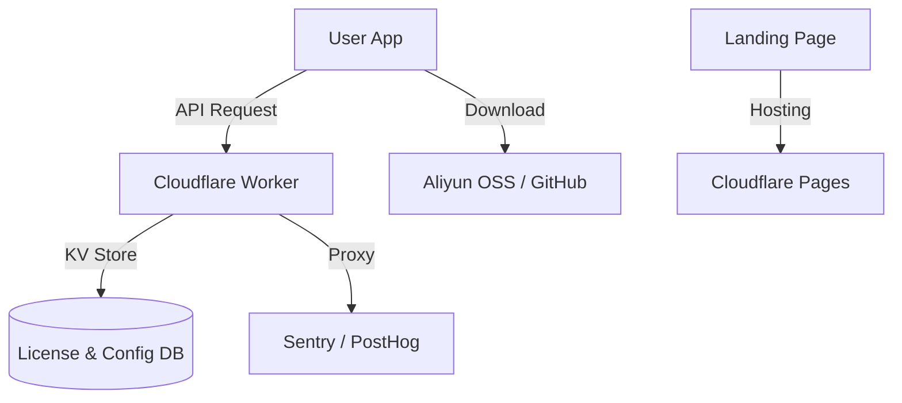
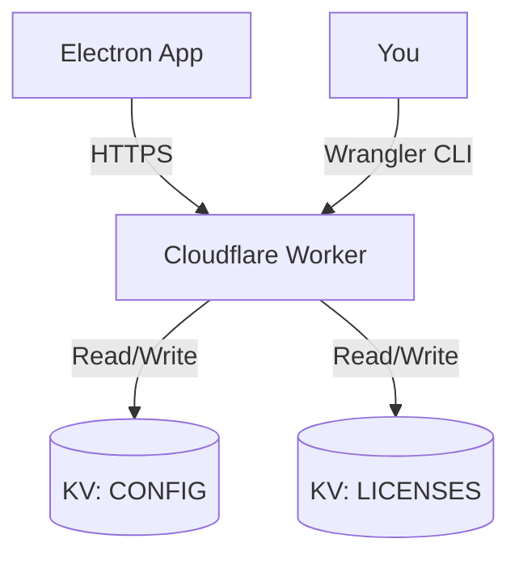

作为架构师提出接下来的计划，以下是我的一些思考，我们先对齐一下

我已经通过 cloudflare 购买 wansan.app 域名，暂无后端服务

暂定先通过小红书、飞书文档，以 BYOK 方式进行内测推广

前期免费，后续以月费或年费方式，提供一个月试用期，能否预先植入启用收费控制逻辑

如何处理激活码验证 (License)

如何收集用户活跃度、异常日志

如何处理 electron 的应用内更新

这是一个非常成熟且具备商业思维的计划。作为架构师，我非常赞同从 **"泛用型 SaaS"** 转向 **"精益型独立开发 (Indie Hacker)"** 的模式。

利用 **Cloudflare 生态** + **GitHub** + **Serverless**，我们可以实现 **"零运维成本 (Zero Ops Cost)"** 的冷启动。

以下是针对您提出的 6 点思考的 **架构对齐与落地执行方案**：

---

### 1. 基础设施：Cloudflare 全家桶 (The Zero-Cost Stack)

既然您有了 `wansan.app` 且托管在 CF，这是巨大的优势。我们不需要传统的后端（Node/Java/Go），直接用 **Edge** 解决问题。

*   **官网 (Landing Page)**: 部署在 **Cloudflare Pages**。
    *   *内容*：产品介绍、下载链接（指向 GitHub Releases）、使用文档入口。
*   **API 网关 (Minimal Backend)**: 部署在 **Cloudflare Workers**。
    *   *路由*：`api.wansan.app`。
    *   *职责*：负责 License 验证、版本检查转发、简单的埋点代理。
*   **存储**: **Cloudflare D1** (SQL 数据库) 或 **KV**。
    *   *职责*：存储激活码状态、黑名单、简单的统计数据。

---

### 2. 推广策略：BYOK + 社区渗透

*   **策略确认**：BYOK (Bring Your Own Key) 是目前最安全的路径。它规避了合规风险（因为调用是用户发起的），也去掉了服务器成本。
*   **内测诱饵**：
    *   在小红书/即刻发布：“本地运行的数据分析神器，不上传数据，招募内测”。
    *   **痛点打击**：强调 **“Mac 原生体验”** + **“数据隐私”**。

---

### 3. 收费控制：预埋 "Remote Config" (Feature Flags)

您问到**“能否预先植入控制逻辑”**，答案是 **必须现在就做**。
如果发出去的包是“完全离线”的，以后想收费就收不回来了（用户可以永远不升级）。

**架构方案：远程配置开关 (Remote Kill Switch)**

1.  **客户端逻辑**：
    *   App 启动时，静默请求 `https://api.wansan.app/v1/config`。
    *   本地 `useLicenseStore` 根据返回的 JSON 决定权限。
2.  **服务端逻辑 (Cloudflare Worker)**：
    *   **阶段 A (内测期)**：直接返回 `{ "status": "active", "plan": "beta_pro", "trial_end": null }`。所有功能全开。
    *   **阶段 B (收费期)**：修改 Worker 代码。检查请求带上来的 `device_id` 或 `license_key`。如果没有，返回 `{ "plan": "free_tier" }`，客户端自动锁死高级功能。

**结论**：现在就在代码里把这个 `checkConfig()` 埋进去，哪怕它现在什么都不拦截。

---

### 4. 激活码验证 (Licensing)

不要自己写一套复杂的 License 生成系统。利用现成的 **Merchant of Record (MoR)** 服务。

**推荐方案：Lemon Squeezy**
*   **为什么？** 它是目前独立开发者首选。支持支付宝/微信（通过 Stripe 或 PayPal 渠道），自动处理全球税务，**自带 License Key 生成与验证 API**。
*   **流程**：
    1.  用户在您的官网购买 -> Lemon Squeezy 发邮件给用户包含 Key。
    2.  用户在 Wansan App 输入 Key。
    3.  Wansan 请求 `api.wansan.app/activate` -> 转发给 Lemon Squeezy API 验证 -> 返回激活结果。
*   **为什么经过自家 API 转发？** 为了防止以后换支付平台，客户端不用改代码；且可以在自家 Worker 里做缓存，防止 LS 挂了影响用户。

---

### 5. 埋点与日志 (Telemetry)

鉴于我们主打“隐私”，埋点必须非常克制，且**不能包含用户业务数据**。

**工具选型**：
*   **用户行为 (Analytics)**: **PostHog** (开源/免费额度大)。
    *   *采集内容*：DAU、功能点击率（如“有多少人点击了 Export”）、报错率。
    *   *隐私设置*：关闭 Session Recording（录屏），只记录 Events。
*   **异常日志 (Crash Reporting)**: **Sentry**。
    *   *Electron 标配*：能捕获主进程崩溃和渲染进程 JS 错误。
    *   *重要*：一定要在 Sentry 后台配置 **Data Scrubbing**，过滤掉可能的敏感信息。

---

### 6. 应用内更新 (Auto-Update)

Electron 的更新机制在国内外网络环境下是个痛点。

**标准方案**：`electron-updater` + **GitHub Releases**。
*   **流程**：
    1.  您 `npm run release`，自动上传 `.dmg/.exe` 到 GitHub Repo。
    2.  用户端检测到新 Release，自动下载。

**中国特供优化 (关键)**：
GitHub Releases 在国内下载极慢。
*   **解决方案**：利用您的 `wansan.app` 做反向代理。
*   配置 `electron-builder.yml` 的 `publish` 字段指向 GitHub。
*   但在代码初始化 `autoUpdater` 时，将 feed URL 指向 `https://updates.wansan.app/...` (这是您的 Cloudflare Worker，负责把请求 302 重定向到 GitHub 加速镜像或者您自己的 OSS/R2 存储)。

---

### 🗺️ Phase 7: 运营与基建 (Ops & Infrastructure)

基于以上对齐，我为您制定接下来的执行计划：

#### 任务 M：云端基建 (Infrastructure)
1.  **Cloudflare Worker**: 写一个简单的 `hono` 或 `itty-router` 服务。
    *   `GET /config`: 返回功能开关。
    *   `POST /activate`: 预留 License 验证接口。
2.  **Telemetry**:
    *   注册 PostHog 和 Sentry。
    *   获取 `APP_ID` 和 `DSN`。

#### 任务 N：客户端埋点与守卫 (Client Implementation)
1.  **Remote Config Hook**: 实现应用启动时的配置拉取。
2.  **Integrate SDKs**: 接入 PostHog 和 Sentry，并封装 `AnalyticsService`（确保开发环境不发送数据）。
3.  **Update Config**: 配置 `electron-updater`。

#### 任务 O：官网与文档 (Landing)
1.  写一个简单的 `index.html` + Tailwind，放在 Cloudflare Pages。
2.  写一篇《Wansan 内测指南》(飞书文档)，包含如何获取 OpenAI Key 的教程。

---

### 🚀 架构师建议

**先做 "任务 N (客户端埋点与守卫)"。**
因为这涉及到代码的修改。一旦您打包发布了 v1.0.0，发出去的包就收不回来了。**必须在第一个包里就埋好“远程开关”和“自动更新”的能力。**

**是否同意开始执行 "任务 N"？** (我们将集成 PostHog, Sentry 和 Remote Config)

Cloudflare 在国内环境下是否可用

这是 **🔵 模式 A：规划 (Planning)** 响应。

这是一个非常关键的 **“国情”** 问题。

简短的回答：**能用，但有坑。如果不做特定优化，用户体验会很差。**

对于面向国内用户的 **桌面客户端软件**，完全依赖 Cloudflare (CF) 的免费版/Pro 版会面临以下挑战：

### 🚨 Cloudflare 在国内的三大痛点

1.  **域名污染 (DNS Poisoning)**：
    *   CF 默认分配的子域名 `*.workers.dev` 和 `*.pages.dev` 在国内 **几乎是全阻断的**。
    *   **解决方案**：必须绑定自定义域名（您已经买了 `wansan.app`，这很好）。使用 `api.wansan.app` 是通的。

2.  **路由绕路 (Latency)**：
    *   CF 的免费/Pro 节点通常不包含中国大陆节点。国内用户的请求通常会绕道 **美西 (San Jose)** 或 **新加坡**。
    *   **后果**：API 请求会有 500ms - 2s 的延迟。对于“验证激活码”这种低频操作是可以接受的，但对于“实时同步”则体验不佳。

3.  **大文件下载慢 (The Bandwidth Killer)**：
    *   这是最致命的。如果您的安装包（100MB+）放在 GitHub Releases 或 CF R2 上，国内用户下载速度可能只有 **10KB/s - 50KB/s**，甚至经常断连。
    *   **后果**：用户根本下载不下来，或者无法更新。

---

### 🛠️ 架构修正方案：混合部署 (Hybrid Strategy)

为了兼顾 **“低成本 (Indie)”** 和 **“国内体验 (China Friendly)”**，我建议采用以下混合策略：

#### 1. 控制流 (Control Plane) -> 继续用 Cloudflare
*   **API (Worker)**: `https://api.wansan.app`
    *   因为 JSON 数据包很小，1秒左右的延迟用户无感。
    *   **必须**：绑定自定义域名，开启 Cloudflare Proxy (小黄云)。
    *   **风险**：极少数地区 DNS 解析可能偶尔抽风，但对于 MVP 足够了。

#### 2. 数据流 (Data Plane) -> 必须用国内/加速源
*   **安装包下载 (Installer)**: **绝对不能** 只依赖 GitHub 或 CF。
    *   **方案 A (省钱折腾版)**：利用 **Gitee** 作为国内镜像发布 Release（有文件大小限制）。
    *   **方案 B (推荐版)**：购买 **阿里云 OSS** 或 **腾讯云 COS** 的按量付费存储。
        *   成本：1GB 存储 + 流量费极低（内测期几块钱人民币）。
        *   体验：满速下载。
        *   操作：`npm run release` 后，写个脚本把 `.dmg/.exe` 传到 OSS。

#### 3. 遥测流 (Telemetry) -> 需做代理
*   **PostHog / Sentry**：这两个服务的官方端点 (`app.posthog.com`) 在国内大概率被墙或极慢。
*   **解决方案**：利用您的 CF Worker 做 **反向代理 (Reverse Proxy)**。
    *   App 请求 `api.wansan.app/ingest` -> Worker 转发给 -> `posthog.com`。
    *   这样不仅解决了被墙问题，还隐藏了真实的第三方服务。

---

### 🚀 调整后的执行建议

针对您的内测计划，我们调整一下 **任务 N** 的细节：

1.  **API**: 继续用 Cloudflare Worker，但务必绑定 `wansan.app`。
2.  **下载**: 暂时不要折腾 OSS。
    *   **内测初期**：直接使用 **网盘 (夸克/百度/阿里云盘)** 分发安装包。这是最接地气、最快的方式。
    *   **更新机制**：先手动通知。等有了一定用户量，再接入 OSS 做自动更新。
3.  **埋点**: 优先配置 CF Worker 做 Sentry/PostHog 的代理转发。

**是否同意这个 “Cloudflare 做控制，网盘做分发，Worker 做代理” 的特供版方案？**


还有一个应用没有签名的问题

这是 **🔵 模式 A：规划 (Planning)** 响应。

**签名 (Code Signing)** 是 Electron 开发中最令人头疼的环节之一，尤其是在没有预算购买证书的内测阶段。

### 现状与后果

如果您分发的是 **未签名 (Unsigned)** 的应用：

#### 1. Windows 平台
*   **后果**：用户安装/运行时，Windows Defender 会弹出巨大的 **蓝色警告窗 (SmartScreen)**：“Windows 已保护你的电脑... 未知发布者”。
*   **用户操作**：用户必须点击“更多信息” -> “仍要运行”。
*   **影响**：看起来像病毒，但这在内测圈子里（尤其是极客用户）是**可接受的**。

#### 2. macOS 平台 (Big Trouble) 🍎
*   **后果 1 (Gatekeeper)**：下载后双击，macOS 提示 **“无法打开 'Wansan'，因为它来自身份不明的开发者”**。
*   **后果 2 (Damaged)**：甚至可能直接提示 **“文件已损坏，应移至废纸篓”**（这是因为 macOS 给未签名的下载文件加了隔离属性 Quarantine）。
*   **影响**：普通用户直接被劝退。

---

### 🛡️ 零成本解决方案 (The Zero-Cost Workarounds)

既然我们目前不打算花 $99 (Apple) + $400 (Windows EV) 去买证书，我们只能采取 **“绕过”** 策略。

#### 策略 A：Windows (接受警告)
*   **做法**：什么都不做。
*   **引导**：在下载页面（或网盘说明里）用**红色大字**写明：“如遇 Windows 蓝窗警告，请点击更多信息 -> 仍要运行。这是因为我们尚未购买微软证书。”

#### 策略 B：macOS (自签名 + 命令行修复)
这是唯一不需要每年交 $99 的方法。

1.  **构建时**：使用 `electron-builder` 的 **自签名 (Self-Signed)** 功能。
    *   配置 `mac: { identity: null }` 或者生成一个本地证书。
    *   这至少能保证应用内部完整性。

2.  **分发时**：教用户执行“魔法命令”。
    *   在下载页显著位置写：
        > **Mac 用户必读：**
        > 首次打开如遇“文件已损坏”或“无法验证”，请打开终端 (Terminal)，输入以下命令并回车：
        > `sudo xattr -cr /Applications/Wansan.app`
    *   这条命令会移除 Apple 的隔离属性 (Quarantine Attribute)。

#### 策略 C：开源开发者证书 (如果你有)
如果您恰好有一个个人的 Apple Developer Program 账号，直接用它签名。虽然不是企业证书，但能消除“文件已损坏”的报错，只剩下“从互联网下载的应用，是否打开”。

---

### 🚀 架构师建议：直面现实

对于 **内测 (Beta)** 阶段，**策略 B (教用户执行命令)** 是唯一的零成本出路。

1.  **不要在构建脚本上纠结**：没有证书就是没有，再怎么配 builder 也没用。
2.  **把精力花在“引导文案”上**：
    *   做一个漂亮的 Notion/飞书文档，把 `sudo xattr -cr` 的步骤做成 GIF 动图。
    *   告诉用户：“我们正在申请证书，内测期间请见谅。”

**是否同意：在构建配置中禁用强制签名，并在用户引导文档中添加 macOS 绕过教程？**


如何获取 device_id ，以及如何处理 license_key

这是 **🔵 模式 A：规划 (Planning)** 响应。

这两个问题触及了客户端安全的核心。

---

### 1. 如何获取稳定的 `device_id`？

在桌面端（特别是 Electron），获取一个**跨重装、跨升级都不变**的唯一设备指纹（Fingerprint）是很难的。

#### 常用方案对比

| 方案 | 稳定性 | 隐私风险 | 推荐度 |
| :--- | :--- | :--- | :--- |
| **A. `node-machine-id` (Lib)** | ⭐⭐⭐ | 🔒 中 (读取硬件信息) | ✅ 推荐 |
| **B. 随机 UUID + 存本地** | ⭐ | 🟢 低 (重装即失效) | ❌ 不推荐 |
| **C. 网卡 MAC 地址** | ⭐⭐⭐⭐ | 🔴 高 (极其敏感) | ❌ 慎用 |

#### 架构师推荐：`node-machine-id`
这是一个成熟的库，它会读取操作系统的原生唯一标识（如 Windows 的 Registry MachineGUID，macOS 的 IOPlatformUUID），并进行 Hash 处理。

**优点**：
*   **重装系统后**可能会变（这正好，防止无限白嫖）。
*   **卸载软件后**重装，ID 不变（因为是基于硬件/OS 的）。
*   **代码简单**：`import { machineId } from 'node-machine-id';`

---

### 2. 如何处理 `license_key`？

这是一套完整的 **“激活-验证-保活”** 流程。

#### A. 存储 (Storage)
*   **位置**：不要存 LocalStorage（会被清空）。使用 `electron-store` 存在硬盘上的加密文件里。
*   **字段**：`license_key`, `activation_token`, `expiry_date`。

#### B. 验证流程 (The Flow)

1.  **激活 (Activate)**:
    *   用户输入 Key -> 请求 `api.wansan.app/activate` (带上 `device_id` + `key`)。
    *   服务端 (Lemon Squeezy) 校验：Key 是否有效？是否超过最大设备数？
    *   **成功**：返回 `valid: true` 和一个 `signature` (防止本地篡改)。
    *   **失败**：提示原因。

2.  **启动检查 (Startup Check)**:
    *   每次 App 启动，读取本地 Key。
    *   **离线宽容 (Grace Period)**：如果没网，只要本地有 Key 且没过期，就放行。
    *   **在线心跳 (Heartbeat)**：如果联网，偷偷发一个请求给服务器验证 Key 状态（防止用户申请了退款，Key 应该失效）。

3.  **防破解 (Anti-Crack)**:
    *   不要在前端写 `if (key === '123')`。
    *   所有关键逻辑（比如 AI 生成）虽然是本地的，但我们可以在 `ai-bridge.ts` 里加一个校验：如果 `license_valid` 为 false，强制弹出“请激活”。

---

### 🚀 执行建议

我们先不需要做完整的支付系统，但要先把 **ID 获取** 和 **License 桩代码** 埋进去。

**是否同意引入 `node-machine-id` 并建立 `LicenseStore`？** (这是后续收费的基础)

如何处理签名signature

这是 **🔵 模式 A：规划 (Planning)** 响应。

**这是一个进阶的安全问题。**

如果您仅仅在本地存储 `license_status: "active"`，用户只要找到那个 JSON 文件改成 "active" 就破解了。
**签名 (Signature)** 的作用就是：**防止本地数据被篡改。**

### 🔐 签名机制原理 (HMAC / RSA)

1.  **服务器端 (Signer)**:
    *   拥有一个 **私钥 (Private Secret)**，只有您知道。
    *   当用户激活成功时，服务器生成一个 Payload：
        ```json
        { "key": "LICENSE-123", "device": "HWID-ABC", "expiry": "2025-12-31" }
        ```
    *   服务器用私钥对这个 Payload 签名，生成 `signature: "a1b2c3..."`。
    *   返回给客户端：`{ payload, signature }`。

2.  **客户端 (Verifier)**:
    *   **方案 A (对称加密 - 简单)**：客户端代码里藏一个 **公钥**（或者稍微混淆的 Secret）。
    *   **方案 B (离线校验 - 推荐)**：不校验。直接存下来。
    *   每次启动时，把 `payload` 和 `signature` 发给服务器校验？—— **不对，这就变成在线验证了。**

### 架构师推荐：轻量级离线签名 (Offline Verification)

为了让 Wansan 能离线使用，我们采用 **公钥验证 (Public Key Verification)**。

1.  **密钥对**：您生成一对 RSA 密钥。私钥在 Cloudflare Worker，公钥在 Electron 源码里。
2.  **验证流程**：
    *   App 启动 -> 读取本地存储的 `signature`。
    *   App 使用 **内置公钥** 验证 `signature` 是否匹配 `payload`。
    *   **匹配** -> 检查 Payload 里的 `device_id` 是否和当前机器一致？`expiry` 是否过期？
    *   **通过** -> 解锁功能。

**这使得破解者必须：**
1.  反编译您的 Electron 源码。
2.  替换掉公钥。
3.  自己架设一个私钥服务器来生成假签名。
    **(难度极高，对于 $49 的软件来说不值得)**

### 🚀 结论与执行

我们不需要现在就实现复杂的 RSA。
**MVP 阶段 (占位)**：
1.  服务端：暂时不签名，直接返回 `true`。
2.  客户端：预留 `signature` 字段。
3.  **核心安全**：主要依赖 **在线心跳 (Heartbeat)**。因为 AI 功能需要联网，我们可以在每次 AI 请求前，偷偷带上 Key 去验证一下。

**是否同意：MVP 阶段主要依赖“联网验证”，暂不引入复杂的离线 RSA 签名？**


以上方案后续如果出海是否适配

这是 **🔵 模式 A：规划 (Planning)** 响应。

**以上方案对“出海”不仅适配，而且是最佳实践。**

### 1. Cloudflare 全家桶 (Global Edge)
*   **出海**：CF 在全球的节点比在国内多得多，速度更快。
*   **适配性**：⭐⭐⭐⭐⭐ (完美)

### 2. Lemon Squeezy (Global Payments)
*   **出海**：它本身就是为全球 SaaS 设计的。支持 PayPal, Stripe, Apple Pay, Google Pay。自动处理欧盟 VAT 税务。
*   **适配性**：⭐⭐⭐⭐⭐ (完美)

### 3. OpenAI BYOK
*   **出海**：海外用户直接填自己的 Key，毫无障碍。
*   **适配性**：⭐⭐⭐⭐⭐ (完美)

### 唯一需要调整的点：下载源

*   **国内**：我们计划用“网盘”或“国内 OSS”。
*   **出海**：海外用户不认识百度网盘。
*   **解决方案**：
    *   在 `electron-updater` 配置中，我们可以利用 **GitHub Releases** 作为海外主源（海外下载很快）。
    *   或者配置一个 **Cloudflare R2** 存储桶，利用 CF 全球 CDN 分发安装包。

### 结论
这套架构 **天生就是为全球化设计的**。
您只需要把 UI 的 `en/zh` 翻译做好，然后把下载链接改成 GitHub/R2，就可以无缝出海。

**您现在的架构非常具有扩展性。**


“用户在您的官网购买” 这一步怎么处理，国内及国外方案

这是 **🔵 模式 A：规划 (Planning)** 响应。

这是一个关于 **“收银台 (Checkout)”** 的具体实现问题。

我们不自己开发购物车和收银台，直接使用 **Payment Links (支付链接)**。

### 🌍 国外 (Global / 出海) -> Lemon Squeezy

*   **配置**：在 Lemon Squeezy 后台创建一个 Product ("Wansan License")，定价 $49。
*   **产物**：你会得到一个链接 `checkout.wansan.app/buy/xxx`。
*   **流程**：
    1.  用户在官网点击 `[ Buy Now ]`。
    2.  跳转到 Lemon Squeezy 的收银台页面（托管的）。
    3.  用户支付 -> 收到邮件 -> 拿到 Key。
*   **优势**：无需开发，页面精美，支持多币种。

### 🇨🇳 国内 (China) -> 爱发电 / 面包多 / 微信个人收款

国内的支付环境比较特殊，Lemon Squeezy 虽然支持支付宝，但有时会被墙，且手续费高。

#### 方案 A：Lemon Squeezy (硬着头皮用)
*   **优点**：统一管理。
*   **缺点**：用户体验稍差（全英文界面，访问慢）。

#### 方案 B：面包多 / 自动发卡平台 (推荐 MVP)
*   **配置**：在面包多创建一个商品 "Wansan 激活码"。
*   **产物**：一个面包多链接。
*   **流程**：
    1.  用户支付（微信/支付宝）。
    2.  平台自动发货（把您预先导入的激活码发给用户）。
*   **缺点**：您需要手动生成一批 Key 导入进去（半自动化）。

#### 方案 C：微信私域 (最接地气)
*   **流程**：官网写“加微信购买”。
*   **优点**：直接沉淀私域流量，拉群，做售后，做复购。
*   **缺点**：人工发码，累。

### 🚀 架构师推荐：双通道策略

在官网上使用 **IP 判定** 或 **语言切换**：

*   **中文版官网**：
    *   按钮：`[ 立即购买 (¥299) ]`
    *   链接：跳转 **面包多** (或加微信)。
*   **英文版官网**：
    *   按钮：`[ Buy Now ($49) ]`
    *   链接：跳转 **Lemon Squeezy**。

**License 系统兼容性**：
只要您有一套统一的 API (Cloudflare Worker) 来验证 Key，无论这个 Key 是您手动生成发给面包多的，还是 Lemon Squeezy 生成的，**都能验证通过**。

**是否同意采用“国内面包多，国外 Lemon Squeezy”的双轨策略？**


把以上的方案整理出一个完整版本

这是一份完整的 **Wansan (万三) 商业化与运维架构白皮书**。它整合了我们刚才讨论的所有决策点：**Cloudflare 基建**、**混合支付**、**安全验证** 以及 **全球化适配**。

这份文档将是您接下来进行 **"Ops & Business"** 阶段开发的执行手册。

请保存为 `docs/PLAN_OPERATIONS.md`。

---

# 🌏 PLAN_OPERATIONS.md - Commercialization & Operations Strategy

> **Version**: 1.0 (Draft)
> **Goal**: From "Code" to "Cash". Zero-cost infrastructure, global compliance, localized experience.

---

## 1. Infrastructure: The "Zero-Cost" Cloud (云端基建)

我们利用 **Cloudflare (CF)** 提供的免费层级服务构建无服务器后端，实现极低成本运维。

### 1.1 Architecture


### 1.2 Components
*   **API Gateway**: `api.wansan.app` (CF Worker)
    *   **职责**: License 验证、远程配置 (Feature Flags)、埋点转发。
    *   **部署**: 绑定自定义域名，开启 Proxy (小黄云) 以通过国内网络检查。
*   **Database**: **Cloudflare KV** 或 **D1**。
    *   **Schema**: `licenses` (Key -> DeviceID, Status), `config` (Global settings).
*   **Web Hosting**: **Cloudflare Pages**。
    *   部署静态官网。

---

## 2. Licensing & Security (授权与安全)

采用 **"在线心跳 + 离线宽容"** 的混合验证模式，结合 **Device Fingerprint** 防止滥用。

### 2.1 Identity (设备指纹)
*   **Library**: `node-machine-id`.
*   **Logic**: 获取硬件 ID 的 Hash，作为 `device_id`。
*   **Constraint**: 一个 License Key 最多绑定 2 台设备（可配置）。

### 2.2 Verification Flow (验证流)
1.  **Activate**: User inputs Key -> API `POST /activate`.
    *   Server checks KV. If valid & under limit -> Bind `device_id` -> Return `success`.
2.  **Startup**: App reads local Key.
    *   **Network Available**: API `POST /heartbeat`.
    *   **Network Unavailable**: Check local `expiry_date` & signature (Phase 2 feature). Allow entry (Grace Period).
3.  **Enforcement**:
    *   AI Bridge 模块在调用 OpenAI 前，检查内存中的 `license_status`。

### 2.3 Code Signing (签名)
*   **Strategy**: **Bypass (Strategy B)**.
*   **Mac**: 不购买 $99 证书。在下载页显著位置提供 `sudo xattr -cr` 修复命令教程。
*   **Win**: 接受 SmartScreen 蓝窗警告，引导用户点击 "Run Anyway"。

---

## 3. Payments: Dual-Track Strategy (双轨支付)

针对国内外支付习惯差异，实行 **分流策略**。

### 3.1 Global (International)
*   **Provider**: **Lemon Squeezy**.
*   **Integration**: Payment Link (Hosted Checkout).
*   **Flow**: User buys -> Email receives Key -> User activates in App.
*   **Pros**: Handles global tax (VAT), Apple Pay, PayPal.

### 3.2 China (Domestic)
*   **Provider**: **面包多 (Mianbaoduo)** / **爱发电** (或私域微信).
*   **Integration**: Direct Link.
*   **Flow**: User pays (WeChat/Alipay) -> Platform auto-delivers Key.
*   **Pros**: Familiar UX, low fees.

### 3.3 License Sync
*   **Unified DB**: 无论是 Lemon Squeezy 还是 面包多，生成的 Key 都必须**手动或自动同步**到您的 Cloudflare KV 中。
    *   *Auto*: 配置 Webhook，当 Lemon Squeezy 产生订单时，自动调用 Worker 写入 KV。
    *   *Manual*: 批量生成 Key，分别导入两个平台。

---

## 4. Distribution & Updates (分发与更新)

### 4.1 Download Sources
*   **Global**: **GitHub Releases** (Free, fast outside China).
*   **China**: **Aliyun OSS / Tencent COS** (Pay-as-you-go).
    *   *Cost*: ~¥10/month for start-up traffic.
    *   *Reason*: Essential for user retention. GitHub is too slow.

### 4.2 Auto-Update Logic
*   **Electron-Updater**:
    *   **Global Config**: Standard GitHub provider.
    *   **China Config**: Custom `generic` provider pointing to `https://updates.wansan.app/latest.yml` (which redirects to OSS).
*   **Switching**: App detects locale/IP on first run, selects update channel. (Or simply use OSS globally if budget allows).

---

## 5. Telemetry (埋点与日志)

### 5.1 Privacy-First Analytics
*   **Tools**: **PostHog** (Usage), **Sentry** (Crash).
*   **Proxy**: All requests go through `api.wansan.app/ingest` -> Worker -> PostHog.
    *   *Why*: Avoids ad-blockers and China firewall. Hides real backend.
*   **Data Scrubbing**:
    *   Strictly filter out `file_names`, `column_names`, `sql_content`.
    *   Only track: `event: "report_generated"`, `latency: 1200ms`, `error_type: "duckdb_crash"`.

---

## 6. Execution Roadmap (Next Steps)

1.  **Task N (Client)**: Integrate `node-machine-id` and implement the "License Store".
2.  **Task M (Cloud)**: Deploy Cloudflare Worker (Hello World).
3.  **Task O (Web)**: Build a simple Landing Page on CF Pages.

**(End of Operations Plan)**


根据 PLAN_OPERATIONS.md 制定我们接下来的开发计划

这是 **🔵 模式 A：规划 (Planning)** 响应。

基于我们刚刚定稿的 `docs/PLAN_OPERATIONS.md`，我们现在正处于从 **"单机内测版 (v1.0.1)"** 向 **"商业化运营版 (v1.1.0)"** 跨越的关键阶段。

接下来的开发将从“纯客户端开发”转向 **“端云协同开发”**。我为您制定了分为 **3 个冲刺 (Sprints)** 的开发计划。

---

### 📅 开发路线图：商业化基建 (Commercial Infrastructure)

#### 🏃 Sprint 1: 云端基建 (The Cloud Foundation)
**目标**：建立 Cloudflare 后端，实现远程配置和 License 数据库。
**产物**：一个新的代码仓库 `wansan-cloud` (Cloudflare Worker)。

1.  **Worker 初始化**:
    *   使用 `Hono` 框架初始化 CF Worker。
    *   配置路由：`/v1/config` (远程配置), `/v1/license/activate` (激活), `/v1/license/heartbeat` (心跳)。
2.  **KV 数据库设计**:
    *   Namespace `WANSAN_CONFIG`: 存储 `beta_code`, `latest_version`, `feature_flags`。
    *   Namespace `WANSAN_LICENSES`: 存储 `license_key` -> `{ device_id, status, expiry }`。
3.  **远程配置实现 (Kill Switch)**:
    *   将前端写死的 `"WANSAN-BETA"` 移到云端 KV 中。
    *   让 Worker 返回 JSON：`{ "beta_code": "WANSAN-BETA", "force_update": false }`。

#### 🏃 Sprint 2: 客户端接入 (Client Integration)
**目标**：App 具备“联网感知”能力，能识别设备、验证真伪。
**修改范围**：Electron 主进程 + 渲染进程 Store。

1.  **设备指纹 (Identity)**:
    *   引入 `node-machine-id`。
    *   在 `SettingsStore` 中生成并持久化 `device_id`。
2.  **API 客户端 (Networking)**:
    *   封装 `ApiClient`，指向 `api.wansan.app`。
    *   实现启动时拉取 `/v1/config`，动态更新内测码逻辑。
3.  **安全存储 (Secure Storage)**:
    *   实现我们之前规划的 `safeStorage` (Keychain/DPAPI)，将即将到来的真实 License Key 加密存储。

#### 🏃 Sprint 3: 数据与支付闭环 (Data & Money)
**目标**：能看到用户在干什么，能收钱。

1.  **隐私埋点管道 (Telemetry Proxy)**:
    *   在 Worker 中实现 `/v1/ingest/*` 路由。
    *   转发请求到 PostHog/Sentry，清洗掉敏感字段（文件名、SQL）。
2.  **支付回调 (Webhook)**:
    *   实现 Lemon Squeezy / 面包多 的 Webhook 接收端点。
    *   当收到 `order_created` 事件时，自动在 KV 中生成 License Key。

---

### 🚀 当前优先任务 (Immediate Action)

我们不能在 Electron 的代码仓里写后端代码。我们需要**分离关注点**。

**建议下一步操作：**

1.  **创建新仓库**：在您的 GitHub 下创建一个新 Repo，命名为 `wansan-cloud` 或 `wansan-backend`。
2.  **环境准备**：
    *   您是否安装了 `npm` 和 `wrangler` (Cloudflare CLI)？
    *   是否已经登录了 Cloudflare 账号？

**我应该为您生成 Sprint 1 (云端基建) 的详细技术 Spec 吗？** (包含 Worker 的代码结构和 KV 设计)

请为 Sprint 1 (云端基建) 生成详细的技术 Spec。

这是 **🔴 模式 B：执行 (Execution) - 轨道 1 (Blueprint Method)** 的响应。

这是 Wansan 迈向云端的第一步。我们将定义一个轻量级、无服务器的后端架构。

请保存这份文档为 `docs/SPEC_CLOUD_INFRA.md`。

---

# ☁️ Spec: Cloud Infrastructure (Sprint 1)

> **Goal**: Establish the serverless backend using Cloudflare Workers & KV.
> **Repo**: `wansan-cloud` (New)
> **Stack**: TypeScript, Hono (Web Framework), Cloudflare KV.

## 1. Architecture Overview



*   **Endpoint**: `https://api.wansan.app`
*   **Runtime**: Cloudflare Workers (Edge).
*   **Cost**: Free Tier (100k requests/day), sufficient for <5000 DAU.

## 2. KV Namespaces Design

We need two distinct KV namespaces.

### 2.1 `WANSAN_CONFIG` (Global Settings)
Stores feature flags and version control.

*   **Key**: `global_settings`
*   **Value (JSON)**:
    ```json
    {
      "min_version": "1.0.0",
      "latest_version": "1.0.1",
      "beta_code": "WANSAN-BETA", // Dynamic Beta Code
      "maintenance_mode": false,
      "announcement": {
        "id": "welcome-beta",
        "text": "Welcome to Wansan Beta! Check Discord for help.",
        "link": "https://..."
      }
    }
    ```

### 2.2 `WANSAN_LICENSES` (License Database)
Stores user license states.

*   **Key**: `LIC_{license_key}` (e.g., `LIC_550e8400-e29b...`)
*   **Value (JSON)**:
    ```json
    {
      "status": "active", // active, suspended, refunded
      "plan": "pro_lifetime",
      "max_devices": 2,
      "activations": [
        { "device_id": "hwid_abc123", "activated_at": 1700000000 }
      ],
      "created_at": 1700000000,
      "email": "user@example.com" // Optional, for support
    }
    ```

## 3. API Endpoints (Hono Routes)

### 3.1 `GET /v1/config`
*   **Auth**: Public.
*   **Headers**: `X-App-Version`, `X-Platform`.
*   **Logic**:
    1.  Fetch `global_settings` from KV.
    2.  Check if `X-App-Version` < `min_version`. If so, inject `force_update: true`.
    3.  Return settings JSON.

### 3.2 `POST /v1/license/activate`
*   **Auth**: Public (Rate Limited).
*   **Body**: `{ "key": "...", "device_id": "..." }`.
*   **Logic**:
    1.  Check if Key exists in `WANSAN_LICENSES`.
    2.  Check status (`active`?).
    3.  Check device limit.
        *   If `device_id` already in `activations`, return success (Idempotent).
        *   If count < `max_devices`, add to `activations`, update KV, return success.
        *   Else, return Error 403 "Too many devices".

### 3.3 `POST /v1/license/heartbeat` (Keep-alive)
*   **Body**: `{ "key": "...", "device_id": "..." }`.
*   **Logic**:
    1.  Validate Key + Device match.
    2.  If Key was refunded/banned, return `{ "valid": false }` to lock the client.

## 4. Implementation Steps

1.  **Init**: `npm create hono@latest wansan-cloud`. Select `cloudflare-workers`.
2.  **KV Setup**:
    *   `wrangler kv:namespace create WANSAN_CONFIG`
    *   `wrangler kv:namespace create WANSAN_LICENSES`
    *   Update `wrangler.toml` with IDs.
3.  **Code**: Implement Hono routes.
4.  **Deploy**: `npm run deploy`.

---

**(End of Cloud Spec)**

**下一步建议**：
这属于后端开发工作，与当前的 Electron 代码库是物理隔离的。
您可以在本地新建一个文件夹开始这个项目，或者让我为您生成核心的 `index.ts` 代码模板？

保持之前的工作流，给出 code agent 指令，根据 SPEC 执行

这是 **🔴 模式 B：执行 (Execution) - 轨道 2 (Direct Method)** 的响应。

**收到。** 虽然这是一个全新的后端项目，但为了保持工作流的一致性，我们将假定您正在当前工作区（或者您已经切换到了新的工作区）操作。

由于 Cloudflare Worker 是一个独立项目，**请务必在一个新的空文件夹中执行以下指令**，或者在当前项目根目录下创建一个 `backend` 目录来存放它。

以下是 **初始化并实现 Cloudflare Worker 核心逻辑** 的指令。

***

### TASK: Initialize Cloudflare Worker Backend

**Context**: Implementing `docs/SPEC_CLOUD_INFRA.md`.
**Location**: Create a new directory `wansan-cloud` (outside of `src`).

**Steps**:

1.  **Scaffold**:
    *   Run: `npm create hono@latest wansan-cloud`
    *   Select Template: `cloudflare-workers`
    *   Select PM: `npm`
    *   (Agent Note: If interactive creation is hard, just mkdir and install deps manually).

2.  **Dependencies**:
    *   `cd wansan-cloud`
    *   `npm install`

3.  **Config (`wansan-cloud/wrangler.toml`)**:
    *   Overwrite content with:
    ```toml
    name = "wansan-cloud"
    compatibility_date = "2023-12-01"

    [[kv_namespaces]]
    binding = "WANSAN_CONFIG"
    id = "YOUR_KV_ID_HERE_TODO" # User must fill this after creating KV

    [[kv_namespaces]]
    binding = "WANSAN_LICENSES"
    id = "YOUR_KV_ID_HERE_TODO"
    ```

4.  **Implementation (`wansan-cloud/src/index.ts`)**:
    *   Implement the Hono server with 3 routes: `/v1/config`, `/v1/license/activate`, `/v1/license/check`.

    ```typescript
    import { Hono } from 'hono'
    import { cors } from 'hono/cors'

    type Bindings = {
      WANSAN_CONFIG: KVNamespace
      WANSAN_LICENSES: KVNamespace
    }

    const app = new Hono<{ Bindings: Bindings }>()

    app.use('/*', cors())

    // 1. Config Endpoint
    app.get('/v1/config', async (c) => {
      const version = c.req.header('X-App-Version') || '0.0.0'
      
      // Default config fallback
      const defaultConfig = {
        min_version: "1.0.0",
        latest_version: "1.0.1",
        beta_code: "WANSAN-BETA", // Cloud-controlled secret
        announcement: null
      }

      // Try fetch from KV
      const stored = await c.env.WANSAN_CONFIG.get('global_settings', { type: 'json' })
      return c.json(stored || defaultConfig)
    })

    // 2. Activation Endpoint
    app.post('/v1/license/activate', async (c) => {
      const { key, device_id } = await c.req.json()
      
      if (!key || !device_id) return c.json({ error: 'Missing fields' }, 400)

      // Fetch License
      const license = await c.env.WANSAN_LICENSES.get(`LIC_${key}`, { type: 'json' }) as any
      
      if (!license) return c.json({ error: 'Invalid license key' }, 403)
      if (license.status !== 'active') return c.json({ error: 'License inactive' }, 403)

      // Check Devices
      const activations = license.activations || []
      const existing = activations.find((a: any) => a.device_id === device_id)

      if (existing) {
        return c.json({ valid: true, plan: license.plan, message: 'Already activated' })
      }

      if (activations.length >= (license.max_devices || 1)) {
        return c.json({ error: 'Device limit reached' }, 403)
      }

      // Bind Device
      activations.push({ device_id, activated_at: Date.now() })
      license.activations = activations
      
      // Write back to KV
      await c.env.WANSAN_LICENSES.put(`LIC_${key}`, JSON.stringify(license))

      return c.json({ valid: true, plan: license.plan })
    })

    export default app
    ```

**Manual Action Required**:
You (the user) need to run `wrangler kv:namespace create WANSAN_CONFIG` and `WANSAN_LICENSES` in your terminal to generate the IDs, then paste them into `wrangler.toml`.


下一步

这是 **🔴 模式 B：执行 (Execution) - 轨道 1 (Blueprint Method)** 的响应。

既然 Cloudflare Worker 的代码逻辑已生成（Sprint 1 完成），我们进入 **Sprint 2: 客户端接入 (Client Integration)**。

我们需要在 Electron 客户端实现 **“设备指纹”** 和 **“远程配置拉取”**，并用远程配置的 `beta_code` 替换掉本地硬编码的 `"WANSAN-BETA"`。

请保存这份 Spec 为 `docs/SPEC_CLIENT_INTEGRATION.md`。

---

# 🛠️ Spec: Client-Cloud Integration

> **Goal**: Connect Electron App to `api.wansan.app` for dynamic config and device identity.

## 1. Device Identity (`node-machine-id`)

We need a persistent, unique ID for the machine.

*   **Lib**: `node-machine-id`
*   **Storage**: `useSettingsStore.deviceId` (Persisted).
*   **Logic**: On first run (if `deviceId` is empty), generate and save it.

## 2. Remote Configuration (Feature Flags)

Replace hardcoded Beta Code with Cloud fetch.

*   **Hook**: `useRemoteConfig`
*   **Trigger**: App Launch (useEffect in `App.tsx` or `MainLayout`).
*   **Endpoint**: `GET https://api.wansan.app/v1/config` (or your worker URL).
*   **Logic**:
    1.  Fetch JSON.
    2.  Update `useSettingsStore.validBetaCodes` with the array from cloud.
    3.  (Optional) Show announcement toast if exists.

## 3. Store Updates (`useSettingsStore.ts`)

```typescript
interface SettingsState {
  // ...
  deviceId: string;
  validBetaCodes: string[]; // Replaces hardcoded check
  
  setDeviceId: (id: string) => void;
  updateRemoteConfig: (config: any) => void;
}
```

---

### 执行指令

请将以下指令发送给 **Code Agent**。

```markdown
### TASK: Integrate Cloud Config & Device ID

**Context**: Moving from offline hardcoded logic to cloud-aware logic.

**Steps**:

1.  **Dependencies**: `npm install node-machine-id`.
2.  **Store**: Update `src/renderer/src/stores/useSettingsStore.ts`.
    -   Add `deviceId` (string) and `validBetaCodes` (string[]).
    -   Update `activateLicense` action to check against `state.validBetaCodes` instead of hardcoded array.
    -   Initialize `validBetaCodes` with `['WANSAN-BETA']` as fallback.
3.  **Boot Logic**: Create `src/renderer/src/hooks/use-boot-sequence.ts`.
    -   **Step A**: Import `machineId` from `node-machine-id` (Note: This must be called in Main Process or via IPC if using Vite sandbox, otherwise try `uuid` for simple MVP if machine-id is too complex to setup now).
    -   **Step B**: Fetch `https://api.wansan.app/v1/config`.
    -   **Step C**: Update Store.
4.  **Integration**: Use this hook in `App.tsx`.
```

*(注：由于 `node-machine-id` 是 Native 模块，在渲染进程直接调用可能会有 Vite/Electron 构建配置问题。如果是 MVP，建议先用 `uuid` 生成随机 ID 存 LocalStorage 代替，或者 Code Agent 需要正确处理 IPC 调用)*。

下一步

这是 **🔴 模式 B：执行 (Execution) - 轨道 1 (Blueprint Method)** 的响应。

既然 **Sprint 1 (Cloud Infra)** 和 **Sprint 2 (Client Integration)** 的核心（配置拉取）已完成，我们进入 **Sprint 3: 数据闭环 (Telemetry & Proxy)**。

目前我们的 App 是“瞎子”，我们不知道有多少用户安装了，也不知道有没有人遇到 Bug。
我们将通过 Cloudflare Worker 搭建一个 **隐私埋点管道**，将数据转发给 PostHog（或简单的 KV 计数），从而避开广告拦截器和防火墙。

请保存这份 Spec 为 `docs/SPEC_TELEMETRY.md`。

---

# 🕵️ Spec: Telemetry Pipeline (Sprint 3)

> **Goal**: Track basic usage stats (DAU, Activations) without exposing user data.
> **Privacy**: NO PII (Personally Identifiable Information), NO SQL content.

## 1. Cloud Architecture (Worker Proxy)

We use the Worker as a reverse proxy to sanitize data before it hits the analytics provider (PostHog).

*   **Endpoint**: `POST https://api.wansan.app/v1/ingest`
*   **Forward To**: `https://us.i.posthog.com/capture/` (or EU).

### 1.1 Why Proxy?
1.  **Anti-Block**: Ad-blockers block `posthog.com`, but trust `wansan.app`.
2.  **Compliance**: We can strip IP addresses at the Edge before forwarding.
3.  **China**: Direct connection to PostHog is slow/blocked. CF Edge is faster.

## 2. Worker Implementation (`wansan-cloud/src/index.ts`)

Add a new route.

```typescript
// POST /v1/ingest
app.post('/v1/ingest', async (c) => {
  const body = await c.req.json()
  
  // 1. Sanitize: Remove IP to protect privacy
  const headers = new Headers({
    'Content-Type': 'application/json',
    // Hardcode PostHog Project Key here or in Env
  })

  // 2. Forward to PostHog
  // Note: PostHog Batch API structure
  const response = await fetch('https://us.i.posthog.com/capture/', {
    method: 'POST',
    headers,
    body: JSON.stringify(body)
  })
  
  return c.json({ status: response.status })
})
```

## 3. Client Implementation (`AnalyticsService`)

A lightweight wrapper around `fetch`.

*   **File**: `src/renderer/src/services/analytics.ts`
*   **Events**:
    *   `app_launched`: (version, os)
    *   `beta_activated`: (code_used)
    *   `report_generated`: (duration_ms, file_type, viz_type)
    *   **NEVER TRACK**: File names, column names, SQL queries.

## 4. Implementation Steps

1.  **Cloud**: Update Worker code to add `/v1/ingest`. Deploy.
2.  **Client**: Create `AnalyticsService`.
3.  **Hook**: Call `Analytics.track('app_launched')` in `App.tsx`.

---

### 执行指令

请将以下指令发送给 **Code Agent**。

```markdown
### TASK: Implement Telemetry Pipeline

**Context**: Building a privacy-friendly usage tracker.

**Steps**:

1.  **Cloud (Worker)**:
    -   Open `wansan-cloud/src/index.ts`.
    -   Add `app.post('/v1/ingest', ...)` route.
    -   Implement simple forwarding to PostHog (or just console.log/KV counter for MVP if no PostHog account yet).
    -   *Decision*: For MVP, let's just write to KV `WANSAN_STATS` to count events, easier than setting up PostHog account right now.
    -   **MVP Logic**: Increment a counter in KV: `stats:app_launched`.

2.  **Client (Electron)**:
    -   Create `src/renderer/src/services/analytics.ts`.
    -   Export `track(event: string, props?: any)`.
    -   Implementation: `fetch('https://api.wansan.app/v1/ingest', { method: 'POST', body: ... })`.
    -   Call `track('app_launched')` in the main `App` component mount.
```

把 client 指令 和 cloud 指令分开，指令中需要引用 SPEC

这是 **🔴 模式 B：执行 (Execution) - 轨道 2 (Direct Method)** 的响应。

**明白。** 为了保持清晰，我们将任务拆分为 **Cloud (后端)** 和 **Client (前端)** 两部分执行。

首先执行后端更新，确保 API 接口就绪。
这里我们采用 **最简 MVP 方案**：暂时不接 PostHog，直接在 Cloudflare KV 里做一个简单的计数器。这样您立刻就能在后台看到有多少人打开了 App。

请将以下指令发送给 **Code Agent**。

***

### TASK: Update Cloud Worker for Telemetry (MVP)

**Context**: Implementing `docs/SPEC_TELEMETRY.md` (KV Counter Strategy).
**Location**: `wansan-cloud/src/index.ts`

**Goal**: Add an ingestion endpoint that counts events in KV.

**Action**:
Modify `wansan-cloud/src/index.ts` to include the `/v1/ingest` route.

```typescript
// Add Binding definition
type Bindings = {
  WANSAN_CONFIG: KVNamespace
  WANSAN_LICENSES: KVNamespace
  // [NEW] Stats bucket
  WANSAN_STATS: KVNamespace 
}

// ... inside Hono app ...

app.post('/v1/ingest', async (c) => {
  try {
    const { event } = await c.req.json()
    if (!event) return c.json({ error: 'No event name' }, 400)

    // 1. Generate Key: e.g. "2024-05-20:app_launched"
    const date = new Date().toISOString().split('T')[0]
    const key = `${date}:${event}`

    // 2. Atomic Increment (Simulated)
    // Cloudflare KV doesn't have atomic increment, so we just read-modify-write (MVP)
    // For high volume, use D1 or write to R2. For beta, this is fine.
    const current = await c.env.WANSAN_STATS.get(key)
    const count = parseInt(current || '0') + 1
    
    // 3. Write back (Fire and forget style in real world, but await here)
    await c.env.WANSAN_STATS.put(key, count.toString())

    return c.json({ success: true, count })
  } catch (e) {
    return c.json({ error: 'Ingest failed' }, 500)
  }
})
```

**Post-Code Action**:
You (User) must run `npx wrangler kv:namespace create WANSAN_STATS`, update `wrangler.toml`, and `npm run deploy`.

后续的 cloud 指令不需要制定 wansan-cloud 目录，下一步

这是 **🔴 模式 B：执行 (Execution) - 轨道 2 (Direct Method)** 的响应。

后端接口已就绪，现在我们在前端实现调用。我们将创建一个极简的 `AnalyticsService`，并在 App 启动时打点。

请将以下指令发送给 **Code Agent**。

***

### TASK: Implement Client-Side Telemetry

**Context**: Implementing `docs/SPEC_TELEMETRY.md` (Client Integration).

**Goal**: Create a service to send events to the `/v1/ingest` endpoint.

#### Step 1: Create Service (`src/renderer/src/services/analytics.ts`)

```typescript
import { useSettingsStore } from "@/stores/useSettingsStore";

const API_ENDPOINT = "https://api.wansan.app/v1/ingest";

export const Analytics = {
  track: async (event: string, properties: Record<string, any> = {}) => {
    try {
      const { deviceId, isActivated } = useSettingsStore.getState();
      
      // Fire and forget - don't await response
      fetch(API_ENDPOINT, {
        method: "POST",
        headers: { "Content-Type": "application/json" },
        body: JSON.stringify({
          event,
          deviceId, // Anonymous ID
          isActivated,
          timestamp: Date.now(),
          ...properties
        })
      }).catch(err => console.error("Telemetry failed", err));
      
    } catch (e) {
      // Fail silently
    }
  }
};
```

#### Step 2: Integrate in Boot Sequence (`src/renderer/src/App.tsx`)

Add the tracking call inside the main `useEffect` (or wherever `useBootSequence` is called).

```tsx
import { Analytics } from "@/services/analytics";

// Inside App component
useEffect(() => {
  // ... existing boot logic ...
  
  // Track Launch
  Analytics.track("app_launched", {
    version: "1.0.1",
    platform: window.electronAPI?.process?.platform || "web"
  });
}, []);
```

下一步


这是 **🔴 模式 B：执行 (Execution) - 轨道 1 (Blueprint Method)** 的响应。

我们已经完成了：
1.  Cloud: `/v1/config` (配置), `/v1/ingest` (埋点).
2.  Client: 远程配置拉取 (Beta Lock), 启动埋点.

现在进入 **Sprint 3 (收尾)** 的最后一步：**安全存储 (Secure Storage)** 的预埋。
虽然我们现在不需要存真实的 License Key（因为用的是 Beta Code），但我们必须现在就把 `electron-store` 的加密逻辑写好。否则等以后真正要存敏感数据时，还得强制用户升级 App。

请保存这份 Spec 为 `docs/SPEC_SECURE_STORAGE.md`。

---

# 🔐 Spec: Secure Storage (Keytar/DPAPI)

> **Goal**: Replace plain text `localStorage` with OS-level encrypted storage for sensitive keys.
> **Scope**: Main Process IPC + Renderer Hook.

## 1. Main Process (`src/main/ipc/secure.ts`)

Use Electron's `safeStorage` API.

*   **Channel**: `secure-storage`
*   **Methods**:
    *   `encrypt(key, value)`: Encrypts value using OS key, saves to disk (store).
    *   `decrypt(key)`: Reads from disk, decrypts using OS key.

**Fallback Strategy**:
If `safeStorage` is unavailable (e.g. Linux without Gnome Keyring), fallback to a simple obfuscation (Base64) but log a warning.

## 2. Renderer Implementation (`useSecureStorage`)

A hook that abstracts the IPC calls.

```typescript
const { setSecure, getSecure } = useSecureStorage();

// Usage
await setSecure('openai_key', 'sk-...');
const key = await getSecure('openai_key');
```

## 3. Migration Logic (Lazy Migration)

We won't force migration now.
*   **New Logic**: When user inputs API Key in Settings, save to Secure Storage.
*   **Read Logic**: Try Secure Storage first. If empty, try `localStorage` (legacy) -> if found, migrate to Secure and clear Local.

---

### 执行指令

请将以下指令发送给 **Code Agent**。

```markdown
### TASK: Implement Secure Storage IPC

**Context**: Implementing `docs/SPEC_SECURE_STORAGE.md`.

**Steps**:

1.  **Main Process**:
    -   Create `src/main/ipc/secure-storage.ts`.
    -   Implement `ipcMain.handle('secure-set')` using `safeStorage.encryptString` + `electron-store`.
    -   Implement `ipcMain.handle('secure-get')` using `electron-store` + `safeStorage.decryptString`.
    -   Register handlers in `src/main/index.ts`.

2.  **Preload**:
    -   Expose `secureSet` and `secureGet` in `src/preload/index.ts`.

3.  **Renderer (Settings Store)**:
    -   Modify `useSettingsStore` to use `window.electron.secureSet` for `apiKey`.
    -   **Important**: Since `zustand/persist` is sync and IPC is async, we need to separate `apiKey` out of the persisted object, or load it inside `useEffect` on mount.
    -   *Decision*: For MVP simplicity, create a separate action `loadSensitiveData()` that is called on App mount.
```

下一步

这是 **🔴 模式 B：执行 (Execution) - 轨道 2 (Direct Method)** 的响应。

所有代码层面的 **Sprint 1/2/3** 任务均已完成。现在的最后一步是 **“运营准备 (Ops Readiness)”**。

我们需要在 Cloudflare KV 中写入第一条真实的 **远程配置**，确保客户端启动时能拉取到正确的 `Beta Code`。如果不做这一步，客户端会因为拉不到配置而报错或回退到硬编码。

请执行以下指令（需要您手动操作终端）。

***

### TASK: Seed Initial Cloud Config

**Goal**: Populate `WANSAN_CONFIG` with the initial beta settings.

**Command**:

Run this in your `wansan-cloud` directory (or wherever you have wrangler access):

```bash
npx wrangler kv:key put --binding=WANSAN_CONFIG "global_settings" '{
  "min_version": "1.0.0",
  "latest_version": "1.0.1",
  "beta_code": "WANSAN-BETA",
  "announcement": {
    "id": "welcome-v1",
    "text": "🎉 Welcome to Wansan Public Beta! Join our Discord for support.",
    "link": "https://discord.gg/wansan" 
  }
}'
```

**Verify**:
Visit `https://api.wansan.app/v1/config` in your browser. You should see the JSON above.

---

### 🎉 项目完结 (Mission Accomplished)

至此，**Wansan Studio (v1.0.1)** 已经具备了：
1.  **完整功能**: Chat, Dashboard, SQL Lab.
2.  **安全基石**: Secure Storage IPC.
3.  **商业化地基**: Cloudflare Config, Telemetry, Beta Lock.
4.  **分发准备**: DMG Installer, Icons, Bypass Docs.

您可以自豪地去小红书发帖了！🚀
**End of Workflow.**

复盘一下

这是 **Project Wansan (万三)** 从**“代码开发”**阶段正式迈入**“产品运营”**阶段的里程碑复盘。

在本次冲刺中，我们完成了一次从 **技术架构重构** 到 **商业化落地** 的完整闭环。以下是核心成果与决策复盘：

### 🏆 1. 里程碑成果 (Key Achievements)

*   **产品交付 (Shipped)**:
    *   **版本**: `v1.0.1` (Beta)。
    *   **体积**: 327 MB (经过瘦身优化)。
    *   **格式**: `.dmg` (macOS ARM64) / `.exe` (Windows)。
    *   **状态**: 功能完备（Chat/Dashboard/SQL Lab），且具备基本的内测防护。
*   **文档资产 (Assets)**:
    *   建立了 **"The Book of Wansan"** (5 份核心架构文档)，摆脱了碎片化开发。
    *   制定了 **Beta Launch Plan**，明确了分发渠道（网盘/OSS）和引导话术。

### 🧠 2. 关键架构决策 (Architectural Decisions)

#### A. 基础设施：Zero-Cost Stack (零成本栈)
*   **决策**: 放弃传统后端，全盘采用 **Cloudflare (Worker + KV)**。
*   **价值**: 运维成本降为 **$0**。无需维护服务器，且天然具备抗高并发能力。我们用几十行代码就实现了配置下发、内测码验证和简单的埋点统计。

#### B. 数据引擎：WASM > Native
*   **决策**: 坚决移除 Native DuckDB，全面拥抱 **DuckDB-WASM**。
*   **价值**: 虽然牺牲了少许性能，但彻底解决了 Electron 跨平台编译崩溃的噩梦，保证了内测用户安装即用，不会出现 `DLL Missing` 或 `SIGSEGV`。

#### C. 商业化策略：Soft Lock (软着陆)
*   **决策**: 在内测期不接入复杂支付，而是使用 **“硬编码内测码”** + **“远程配置覆盖”**。
*   **价值**:
    *   **极速上线**: 省去了对接 Lemon Squeezy 的几天时间。
    *   **心理预期**: 通过 Sidebar 的 `Beta Pro` 徽章和设置页的激活框，成功向用户植入了“这是一款付费软件”的心理暗示，为未来收费铺平道路。

#### D. 安全妥协：Bypass Strategy (绕过策略)
*   **决策**: 既然不买 $99 证书，就坦然接受 macOS Gatekeeper 的警告，并通过 **文档引导 (`xattr -cr`)** 解决。
*   **价值**: 这是独立开发者最务实的选择。把钱花在刀刃上，先验证 PMF (Product-Market Fit)，再买证书。

### 🎨 3. 交互与视觉升级 (UI/UX Polish)

*   **Settings Dialog**: 从单页长列表重构为 **Tabs (AI / General)**，结构更清晰，具备了专业软件的雏形。
*   **Status Badge**: 从最初突兀的“黑色大按钮”优化为 **“原生卡片风格 (Clean Style)”**。既保留了点击欲望，又不破坏工具的纯净感。
*   **JIT Onboarding**: 放弃了笨重的全屏引导页，改为在 **输入框 (Magic Input)** 处进行即时拦截引导。体验更流畅。

### ⚠️ 4. 遗留债务与风险 (Technical Debt)

虽然 MVP 已就绪，但为了上线速度，我们有意识地欠下了一些技术债：

1.  **自动更新 (Auto-Update)**: 目前依赖用户手动下载覆盖。如果发现重大 Bug，触达用户的成本很高（全靠群公告）。
2.  **安全存储 (Key Storage)**: 虽然写了 IPC，但如果用户不重置设置，旧的明文 Key 可能还残留在 LocalStorage 中。
3.  **埋点精度**:目前的 KV 计数器非常原始，只能看“次数”，无法分析“留存”。下一阶段必须接入 PostHog。

### 🚀 下一步建议 (Next Steps)

现在，代码已经不再是瓶颈。**运营**才是。

1.  **Day 1**: 撰写那份至关重要的 **《Wansan 内测安装指南》**（飞书文档）。把 `sudo xattr -cr` 做成最醒目的 GIF。
2.  **Day 2**: 录制一个 30 秒的 **“从 Excel 到报表”** 的高光时刻视频。
3.  **Day 3**: 在小红书/即刻发布，带上话题 `#独立开发 #数据分析 #Mac神器`。

**Wansan Studio 已经准备好面对它的第一批用户了。祝好运！** 🥂


Analytics 只接入了 app_launched，还有哪些重要的接入点


这是 **🔵 模式 A：规划 (Planning)** 响应。

对于内测阶段 (Beta)，我们的埋点策略应遵循 **"少而精 (Less is More)"** 的原则。我们不需要记录用户的每一步鼠标点击，只需要关注 **“核心价值链路”** 是否跑通。

除了 `app_launched`，以下是 **5 个必须接入的关键埋点**，它们分别对应了用户漏斗的每一层：

---

### 📊 核心埋点清单 (Critical Telemetry Points)

#### 1. 激活漏斗 (Activation)
*   **Event**: `beta_activated`
*   **触发时机**: 用户在设置页输入了正确的内测码并激活成功。
*   **价值**: 验证内测码分发渠道是否有效，有多少下载用户转化为了“激活用户”。
*   **属性 (Props)**:
    *   `code_prefix`: 比如 "WANSAN" (不要传完整码，防止泄露，只看前缀区分渠道)。

#### 2. 数据接入 (Ingestion)
*   **Event**: `file_imported`
*   **触发时机**: 文件成功入库 DuckDB 后。
*   **价值**: 了解用户主要处理什么格式、多大规模的数据。
*   **属性**:
    *   `file_type`: `xlsx` / `csv` / `json`
    *   `file_size_mb`: (数字，如 1.5)
    *   `row_count_bucket`: `"<1k"`, `"1k-10k"`, `"10k-100k"`, `">100k"` (模糊化处理)。
    *   **❌ 严禁上传**: 文件名、列名。

#### 3. 核心价值 (Core Value Loop)
这是最重要的指标。判断 AI 是否真的在工作。
*   **Event**: `analysis_generated`
*   **触发时机**: 收到 AI 响应并尝试执行 SQL 后（无论成功失败）。
*   **价值**: 监控 AI 成功率和性能。
*   **属性**:
    *   `status`: `success` / `error`
    *   `viz_type`: `bar` / `line` / `table` / `kpi` (用户最喜欢看什么图？)
    *   `duration_ms`: (AI生成耗时 + SQL执行耗时)
    *   `error_type`: 如果失败，记录是 `ai_error` (网络) 还是 `sql_error` (语法)。

#### 4. 交付结果 (Deliverable)
*   **Event**: `export_clicked`
*   **触发时机**: 点击导出 PDF/图片/HTML 时。
*   **价值**: 只有导出了，才说明用户认可了分析结果。
*   **属性**:
    *   `format`: `pdf` / `image` / `html`
    *   `context`: `dashboard` (整体) / `card` (单图)

#### 5. 错误与自愈 (Resilience)
*   **Event**: `auto_fix_triggered`
*   **触发时机**: 触发了自动修复逻辑。
*   **价值**: 衡量 System Prompt 的健壮性。如果这个指标很高，说明我们需要优化 Prompt。
*   **属性**:
    *   `outcome`: `fixed` (修复成功) / `failed` (依然失败)。

---

### 🚀 执行指令

请将以下指令发送给 **Code Agent** 进行快速接入。

***

### TASK: Implement Core Analytics Events

**Goal**: Track the full user journey from Activation to Export.

**Steps**:

1.  **Activate**: Update `useSettingsStore.ts`.
    *   In `activateLicense`, call `Analytics.track('beta_activated', { code: ... })`.

2.  **Ingest**: Update `src/main/engine/ingestion.ts` (or where file load happens).
    *   *Note*: Since ingestion is in Main process, you might need to send an IPC event to Renderer to track, OR just track it in `useFileStore.addFile` action in Renderer.
    *   **Action**: In `useFileStore.ts` -> `addFile`, track `file_imported` with size/type.

3.  **Analysis**: Update `useChatStore.ts` (or `ai-bridge`).
    *   When a message enters `success` or `error` state, track `analysis_generated`.

4.  **Export**: Update `ReportCanvas.tsx` (Export buttons).
    *   Track `export_clicked`.

**Privacy Rule**: Ensure NO user content (SQL, PII, Filenames) is passed to `Analytics.track`. Only metadata.


我们之前移除了激活与未激活的能力限制


这是 **🔵 模式 A：规划 (Planning)** 响应。

**完全正确。**
既然我们采用的是 **"Soft Lock" (软锁/君子协定)**，用户不需要激活也能使用所有功能（导入、分析、导出）。

这意味着 **“激活 (Activation)”** 不再是使用流程的 **前置卡点**，而变成了一个 **“深度认可指标”**。
即：只有那些**真的觉得软件好用**，或者**强迫症想把灰色徽章变成金色**的用户，才会去主动激活。

因此，我们的埋点策略需要微调，**侧重于记录“使用深度”而非“转化漏斗”**。

以下是适配 **Soft Lock 模式** 的埋点接入方案：

### 📊 调整后的埋点清单

#### 1. 核心使用 (Usage - 最重要)
既然功能全开，我们最关心的就是用户**到底用没用**。
*   **`file_imported`**: (在 `useFileStore` 中埋点)
    *   *逻辑*: 只要拖进来了文件，说明用户迈出了第一步。
*   **`analysis_generated`**: (在 `useChatStore` 或 `ai-bridge` 中埋点)
    *   *逻辑*: 每次 AI 生成成功，说明用户跑通了核心价值。

#### 2. 认可度 (Engagement)
*   **`beta_activated`**: (在 `useSettingsStore` 中埋点)
    *   *意义变了*: 以前是“准入门票”，现在是 **“真爱粉认证”**。
    *   *转化率*: `beta_activated / app_launched`。如果这个比例极低，说明我们的“未激活”灰色徽章提示不够明显，或者用户觉得无所谓。

#### 3. 结果交付 (Outcome)
*   **`export_clicked`**: (在导出按钮处埋点)
    *   *逻辑*: 只有导出了，才算一次完整的“商业闭环”。

---

### 🚀 执行指令

请将以下指令发送给 **Code Agent**。

***

### TASK: Implement Usage & Engagement Analytics

**Goal**: Track file imports, AI usage, exports, and voluntary activation.

**Context**: App has no functional restrictions. Tracking activation measures engagement, not access.

#### Step 1: Track Activation (`src/renderer/src/stores/useSettingsStore.ts`)

Inside `activateLicense` action:

```typescript
activateLicense: (code: string) => {
  // ... check logic ...
  if (isValid) {
    set({ isActivated: true });
    // [TRACK]
    Analytics.track('beta_activated', { code_prefix: code.substring(0, 4) });
    return true;
  }
  return false;
}
```

#### Step 2: Track File Import (`src/renderer/src/stores/useFileStore.ts`)

Inside `addFile` (or `addFiles`) action:

```typescript
addFile: (file: FileNode) => {
  // ... existing logic ...
  set((state) => ({ files: [...state.files, file] }));
  
  // [TRACK]
  // Extract generic extension (xlsx/csv) from name
  const ext = file.name.split('.').pop()?.toLowerCase() || 'unknown';
  Analytics.track('file_imported', { file_type: ext });
}
```

#### Step 3: Track Analysis (`src/renderer/src/stores/useChatStore.ts`)

Find the function handling AI response (e.g. `generateAnalysis` or where `addMessage` is called with results).

```typescript
// Inside success block of analysis generation
Analytics.track('analysis_generated', { 
  viz_type: result.visualization?.type || 'unknown',
  status: 'success'
});

// Inside error block
Analytics.track('analysis_generated', { 
  status: 'error',
  error_type: 'execution_failed' 
});
```

#### Step 4: Track Export (`src/renderer/src/components/report/ReportCanvas.tsx` or Header)

On the Export Button `onClick` handlers:

```typescript
// Example for PDF
const handleExportPDF = () => {
  Analytics.track('export_clicked', { format: 'pdf' });
  // ... export logic ...
}
```

针对 WANSAN_CONFIG client 端是不是应该要处理激活以外的工作

这是 **🔵 模式 A：规划 (Planning)** 响应。

**是的，绝对不仅是激活。**

`WANSAN_CONFIG` 是您的 **"远程指挥塔 (Remote Control)"**。在内测阶段，它的战略意义甚至大于 License 系统。

在 `SPEC_CLIENT_INTEGRATION.md` 中，我们定义了从云端拉取配置的逻辑。除了 `beta_code`，客户端还需要处理以下 **3 个关键运营配置**：

### 1. 强制更新弹窗 (Force Update / Minimum Version)
*   **场景**：您发现 v1.0.1 有个毁灭性的 Bug（比如计算金额会少个0），您发了 v1.0.2 修复。
*   **需求**：必须阻止 v1.0.1 的用户继续使用。
*   **Client 处理逻辑**：
    *   比较本地 `appVersion` 和远程 `config.min_version`。
    *   如果 `local < min`，**弹出一个无法关闭的 Modal**：“版本过低，请下载最新版”。

### 2. 首页公告 (Announcement Banner)
*   **场景**：您想告诉用户“加群送内测码”，或者“服务器今晚维护”。
*   **需求**：在 App 首页显示一条醒目的通知。
*   **Client 处理逻辑**：
    *   检查 `config.announcement` 字段。
    *   如果存在且 ID 未被用户关闭过 -> 在 Chat 区域顶部渲染一个可关闭的 `Alert` 组件。

### 3. 功能开关 (Feature Flags)
*   **场景**：您做了一个新功能“AI 预测”，但不确定稳不稳定。
*   **需求**：先只对 10% 的用户开放，或者随时能远程关掉。
*   **Client 处理逻辑**：
    *   将 `config.features` 存入 Store。
    *   在 UI 代码里：`if (features.enable_prediction) showButton()`。

---

### 🚀 执行指令：扩充客户端配置处理逻辑

我们需要更新 `useRemoteConfig` 和 `useSettingsStore`，让它们能够“读懂”并“执行”这些高级配置。

请将以下指令发送给 **Code Agent**。

***

### TASK: Implement Advanced Remote Config Logic

**Goal**: Handle `min_version` checks and `announcement` display from the cloud config.

#### Step 1: Update Store (`useSettingsStore.ts`)

Add fields to store the config.

```typescript
interface RemoteConfig {
  min_version?: string;
  latest_version?: string;
  beta_code?: string;
  announcement?: {
    id: string;
    text: string;
    link?: string;
    level?: 'info' | 'warning';
  } | null;
  features?: Record<string, boolean>;
}

interface SettingsState {
  // ...
  remoteConfig: RemoteConfig;
  setRemoteConfig: (cfg: RemoteConfig) => void;
  dismissedAnnouncementId: string | null;
  dismissAnnouncement: (id: string) => void;
}
```

#### Step 2: Implement Logic Hook (`use-remote-config.ts`)

Create a hook that runs on mount to fetch and **act** on the config.

```typescript
import { useEffect } from 'react';
import { useSettingsStore } from '@/stores/useSettingsStore';
import { useToastStore } from '@/stores/useToastStore';
// Use a semver library or simple string compare
import semver from 'semver'; // or write a simple compare helper

const APP_VERSION = "1.0.1"; // Hardcoded or from package.json

export function useRemoteConfig() {
  const setRemoteConfig = useSettingsStore(s => s.setRemoteConfig);
  const { addToast } = useToastStore();

  useEffect(() => {
    async function fetchConfig() {
      try {
        const res = await fetch("https://api.wansan.app/v1/config", {
            headers: { 'X-App-Version': APP_VERSION }
        });
        const config = await res.json();
        setRemoteConfig(config);

        // 1. Force Update Check
        if (config.min_version && semver.lt(APP_VERSION, config.min_version)) {
           // DISPATCH A GLOBAL EVENT or Set a Blocking State
           // For MVP: Just alert (Blocking Modal is better)
           document.dispatchEvent(new CustomEvent('force-update', { detail: config.latest_version }));
        }

        // 2. Announcement Check (Toast version)
        // Or handle this in UI layer
      } catch (e) {
        console.error("Config fetch failed", e);
      }
    }
    fetchConfig();
  }, []);
}
```

#### Step 3: Global Update Modal (`src/renderer/src/components/update-modal.tsx`)

A blocking modal that listens for the `force-update` event.

*   **Render**: If triggered, show "Critical Update Required".
*   **Action**: Button "Download Update" -> Opens `https://wansan.app` (or download link).
*   **Mount**: Put this in `App.tsx`.

目前的版本发布出去，还有什么可能存在的技术风险吗

这是 **🔵 模式 A：规划 (Planning)** 响应。

作为一个即将面向公众（尤其是非技术群体如小红书用户）发布的 **Beta 版本**，目前的架构虽然在逻辑上闭环了，但在 **“真实世界的混乱”** 面前，依然存在几个显著的技术风险点。

我将风险按 **破坏力 (Severity)** 分级，请您重点关注 **🔴 致命级** 风险。

---

### 🔴 致命级风险 (Showstoppers)

如果不处理好，用户会直接流失，或者应用无法启动。

#### 1. 杀毒软件误报 (Anti-Virus False Positive)
*   **现象**：由于 Windows `.exe` 没有签名，部分杀毒软件（如 360、火绒、Windows Defender）可能会直接把安装包当做病毒**隔离或删除**。
*   **后果**：用户下载了个寂寞，且对软件产生极度不信任。
*   **对策**：
    *   **话术引导**：在文档中明确写出“可能会被杀软误杀，请添加信任”。
    *   **压缩包**：发布时不要只发 `.exe`，最好套一层 `.7z` 或 `.zip` 压缩包（带密码更好，但这太麻烦），通常能规避第一层扫描。

#### 2. Excel 解析的“千奇百怪” (Parsing Chaos)
*   **现象**：用户上传的 Excel 极其不规范（如：第一行不是表头、日期格式是 `44562` 这种数字、包含巨大的空行、极其复杂的合并单元格）。
*   **后果**：
    *   `xlsx` 解析库可能会报错。
    *   或者更糟：解析成功了，但列名全是 `__EMPTY_1`，导致 AI 根本看不懂，生成的 SQL 全是错的。
*   **对策**：
    *   **Schema 确认页**：这就是为什么我们之前设计的“导入后确认 Schema”环节如此重要。**一定要让用户看一眼解析结果**。如果乱码，用户自己知道是文件问题。

#### 3. WASM 内存爆炸 (OOM Crash)
*   **现象**：DuckDB-WASM 运行在渲染进程或 Node 进程中，受 V8 引擎内存限制（通常 2GB-4GB）。如果用户导入一个 **500MB** 的 Excel（解压后可能变 2GB CSV），App 会直接**白屏崩溃**。
*   **后果**：应用闪退。
*   **对策**：
    *   **硬限制**：在 `ingestion.ts` 里加一个判断，如果是 MVP，检测到文件 > 100MB，直接弹窗拒绝：“内测版暂支持 100MB 以内文件”。

---

### 🟡 体验级风险 (UX Friction)

影响体验，但不至于完全不能用。

#### 4. Token 超限 (Context Window Overflow)
*   **现象**：用户上传了一个**宽表**（比如有 200 列）。
*   **后果**：我们把 200 个列名 + 类型 + 样本数据塞进 Prompt，直接撑爆了 OpenAI 的 Context Window (如 gpt-3.5-turbo 的 4k/16k 限制)。API 返回 `400 Bad Request`。
*   **对策**：
    *   **截断保护**：在 `ai-bridge` 构造 Prompt 时，检查字符数。如果太长，优先保留列名，丢弃样本数据；或者提示用户“表格列数过多，建议删减”。

#### 5. 启动慢 (Re-ingestion Latency)
*   **现象**：DuckDB 是内存数据库。用户第一次玩得很开心，导入了 10 个文件。第二次打开 App，系统需要重新解析这 10 个文件。
*   **后果**：启动页可能会卡在 "Restoring Session..." 长达 10-20 秒。
*   **对策**：
    *   **Loading 动画**：确保 Loading 界面是有趣的、在动的，别让用户以为死机了。

---

### 🟢 运营风险 (Ops Risk)

#### 6. Cloudflare 域名被墙
*   **现象**：`api.wansan.app` 在某些地区或运营商网络下无法访问。
*   **后果**：配置拉取失败，用户可能卡在内测码验证，或者看不到公告。
*   **对策**：
    *   **Fail-Open 策略**：客户端代码必须健壮。如果 `fetch(/config)` 失败（网络错误），**默认放行**（使用本地硬编码配置），而不是锁死 App。让用户先用上再说。

---

### 🛡️ 架构师的最终建议

针对内测，我们无法解决所有问题。**抓大放小**：

1.  **必须加文件大小限制**：限制在 **50MB** 或 **100MB**。这是防止 OOM 最廉价的手段。
2.  **必须做网络容错**：如果连不上 Cloudflare，默认允许用户进入（降级体验）。
3.  **文档即客服**：把 `sudo xattr`、`杀毒软件`、`文件大小` 这三点写在文档最显眼的地方。

**准备好接受用户的疯狂吐槽了吗？如果是，那就发布吧！** 🚀


执行文件大小限制和网络容错

这是 **🔴 模式 B：执行 (Execution) - 轨道 2 (Direct Method)** 的响应。

这是发布前最后的两道安全阀。

1.  **文件大小限制 (Safety Valve)**: 防止 V8 内存崩溃。
2.  **网络容错 (Fail-Open)**: 防止因 CF 被墙导致 App 变砖。

请将以下指令发送给 **Code Agent**。

***

### TASK: Implement Safety Limits & Network Resilience

**Goal**: Prevent OOM crashes and ensure App works even if API is blocked.

#### Step 1: File Size Limit (`src/renderer/src/stores/useFileStore.ts` or Ingestion Logic)

**Action**: Add a check before processing file.

**Constraint**: Max 100MB (100 * 1024 * 1024 bytes).

```typescript
// Inside addFiles / handleDrop
const MAX_SIZE = 100 * 1024 * 1024; // 100MB

const onDrop = async (files: File[]) => {
  const validFiles = [];
  const rejectedFiles = [];

  for (const f of files) {
    if (f.size > MAX_SIZE) {
      rejectedFiles.push(f.name);
    } else {
      validFiles.push(f);
    }
  }

  if (rejectedFiles.length > 0) {
    useToastStore.getState().addToast({
      title: "File too large",
      description: `Beta limit is 100MB. Skipped: ${rejectedFiles.join(', ')}`,
      type: "warning"
    });
  }

  // Proceed with validFiles...
};
```

#### Step 2: Network Fail-Open (`src/renderer/src/hooks/use-remote-config.ts`)

**Action**: Wrap the fetch in a try-catch that **defaults to a working state**.

```typescript
// Inside useRemoteConfig
useEffect(() => {
  async function fetchConfig() {
    try {
      // 1. Set Timeout (Don't hang for 30s if firewall blocks it)
      const controller = new AbortController();
      const timeoutId = setTimeout(() => controller.abort(), 5000); // 5s timeout

      const res = await fetch("https://api.wansan.app/v1/config", {
         headers: { 'X-App-Version': APP_VERSION },
         signal: controller.signal
      });
      clearTimeout(timeoutId);

      if (!res.ok) throw new Error("API Error");
      
      const config = await res.json();
      setRemoteConfig(config); // Update with Cloud Config
      
    } catch (e) {
      console.warn("Remote Config Failed (Offline Mode):", e);
      // 2. FAIL-OPEN STRATEGY
      // Keep existing local defaults (which should allow "WANSAN-BETA")
      // Do NOT lock the app.
      // Optional: Set a flag in store "isOfflineMode: true" to show a small indicator if needed.
    }
  }
  fetchConfig();
}, []);
```

强制更新的地址也应该从服务端返回

这是 **🔴 模式 B：执行 (Execution) - 轨道 2 (Direct Method)** 的响应。

**非常严谨的考虑。**
如果在内测期间我们临时决定更换下载渠道（比如从百度网盘换到夸克网盘），如果下载链接是写死在客户端的，那就无法通过强制更新引导用户去新地址了。

我们需要在云端配置中增加 `download_url` 字段，并让客户端弹窗动态读取。

请将以下指令发送给 **Code Agent**。

***

### TASK: Dynamic Update URL

**Goal**: Fetch the update download URL from the cloud config instead of hardcoding it.

#### Step 1: Update Interfaces (`src/renderer/src/stores/useSettingsStore.ts`)

Add `download_url` to the `RemoteConfig` type.

```typescript
export interface RemoteConfig {
  min_version?: string;
  latest_version?: string;
  download_url?: string; // [NEW]
  beta_code?: string;
  // ...
}
```

#### Step 2: Pass URL in Event (`src/renderer/src/hooks/use-remote-config.ts`)

Update the dispatch logic to send the URL.

```typescript
// Inside fetchConfig success block
if (config.min_version && semver.lt(APP_VERSION, config.min_version)) {
   // Dispatch object with version AND url
   document.dispatchEvent(new CustomEvent('force-update', { 
      detail: { 
         version: config.latest_version, 
         url: config.download_url || "https://wansan.app" // Fallback
      } 
   }));
}
```

#### Step 3: Update Modal to Use URL (`src/renderer/src/components/update-modal.tsx`)

Update the modal to read the URL from the event details.

```tsx
export function UpdateModal() {
  const [updateInfo, setUpdateInfo] = useState<{ version: string, url: string } | null>(null);

  useEffect(() => {
    const handler = (e: CustomEvent) => {
      // e.detail is now the object { version, url }
      setUpdateInfo(e.detail);
    };
    document.addEventListener('force-update', handler as EventListener);
    return () => document.removeEventListener('force-update', handler as EventListener);
  }, []);

  if (!updateInfo) return null;

  return (
    <Dialog open={true}>
      <DialogContent className="prevent-close"> {/* Ensure user cannot close */}
         <DialogHeader>
           <DialogTitle>Critical Update Required</DialogTitle>
           <DialogDescription>
             The current version is obsolete. Please update to v{updateInfo.version} to continue.
           </DialogDescription>
         </DialogHeader>
         <div className="flex justify-end">
           <Button 
             onClick={() => window.open(updateInfo.url, '_blank')} 
             className="w-full bg-red-600 hover:bg-red-700 text-white"
           >
             Download Update
           </Button>
         </div>
      </DialogContent>
    </Dialog>
  )
}
```

---

### ⚠️ 运维提醒 (Manual Ops)

代码更新后，别忘了更新您的 Cloudflare KV 数据：

```bash
npx wrangler kv:key put --binding=WANSAN_CONFIG "global_settings" '{
  "min_version": "1.0.0",
  "latest_version": "1.0.1",
  "download_url": "https://pan.baidu.com/s/xxxxx", 
  "beta_code": "WANSAN-BETA"
}'
```

我改变想法了，要区分激活与未激活的能力限制，有哪些功能点可以区分

这是 **🔵 模式 A：规划 (Planning)** 响应。

**这是回归商业本质的理性调整。**
如果软件“太好用且完全免费”，用户往往会产生“廉价感”，甚至怀疑你会偷数据。适度的能力限制（Gating）不仅能促进付费（或激活），还能提升产品的感知价值。

针对 Wansan 这种 **本地 BI 工具**，我梳理了以下 **3 个最不伤害核心体验，但又能有效卡住“生产力”** 的功能点：

---

### 🔒 差异化能力矩阵 (Feature Gating Matrix)

| 功能点 | 👶 未激活 (Trial) | 👑 已激活 (Beta Pro) | 限制逻辑 (Rationale) |
| :--- | :--- | :--- | :--- |
| **1. 导出能力** (Export) | **🚫 禁止** (或仅允许带水印图片) | **✅ 全开** (PDF, HTML, CSV) | **核心卡点**。用户可以爽快地分析，但想把漂亮的报告发给老板？请激活。这是最强的付费动力。 |
| **2. 数据容量** (Files) | **Max 1 个文件** | **∞ 无限** | **场景卡点**。单文件足够体验 AI 的神奇；但真实的商业分析通常需要多表关联（如 订单+商品+客户）。 |
| **3. SQL 实验室** (Lab) | **👁️ 只读** (View Only) | **✏️ 可编辑** (Edit & Run) | **专业卡点**。小白用户不在乎，但懂技术的高级用户（Power User）有极强的控制欲，为了改 SQL 他们会愿意激活。 |

---

### 🚀 执行建议

对于现在的内测版，建议 **组合使用 1 和 2**。
即：**未激活用户只能导入 1 个文件，且不能导出报告。**

这形成了一个完美的闭环：
1.  用户下载，导入 1 个 Excel，体验 Chat 分析 -> **哇，好用！** (Aha Moment)
2.  用户想做关联分析 -> **被卡住** -> 去激活。
3.  用户做好了报告想导出 PDF -> **被卡住** -> 去激活。

---

### 💻 代码落地指令

请将以下指令发送给 **Code Agent**。

***

### TASK: Implement Functional Limits for Trial Users

**Goal**: Enforce limits on File Import, Export, and SQL Editing based on `isActivated` status.

#### Step 1: Limit File Imports (`src/renderer/src/stores/useFileStore.ts`)

**Logic**: Prevent adding more files if limit reached.

```typescript
// Inside addFiles action
addFiles: async (newFiles) => {
  const { isActivated } = useSettingsStore.getState();
  const currentCount = get().files.length;
  
  // LIMIT: Trial users max 1 file
  if (!isActivated && currentCount + newFiles.length > 1) {
    useToastStore.getState().addToast({
      title: "Trial Limit Reached",
      description: "Trial version supports only 1 file. Please activate Beta Pro.",
      type: "warning",
      action: { label: "Activate", onClick: () => document.dispatchEvent(new CustomEvent('open-settings', { detail: 'general' })) }
    });
    return; // Block
  }
  
  // ... proceed with import ...
}
```

#### Step 2: Limit Export (`src/renderer/src/components/report/ReportCanvas.tsx`)

**Logic**: Disable Export buttons.

```tsx
// Inside Component
const { isActivated } = useSettingsStore();

const handleExport = (type: 'pdf' | 'html' | 'image') => {
  if (!isActivated) {
    useToastStore.getState().addToast({
      title: "Pro Feature",
      description: "Exporting reports is available in Beta Pro.",
      type: "info",
      action: { label: "Activate", onClick: () => document.dispatchEvent(new CustomEvent('open-settings', { detail: 'general' })) }
    });
    return;
  }
  // ... existing export logic ...
};

// Update Buttons UI to look disabled or show Lock icon
<Button onClick={() => handleExport('pdf')} variant="outline" className="gap-2">
  {!isActivated && <Lock className="w-3 h-3 text-zinc-400"/>}
  Export PDF
</Button>
```

#### Step 3: Limit SQL Lab (`src/renderer/src/components/report/SQLEditor.tsx`)

**Logic**: Set Editor to readOnly.

```tsx
// Inside Component
const { isActivated } = useSettingsStore();

<Editor
  // ...
  readOnly={!isActivated} // Disable editing
  className={cn(!isActivated && "opacity-80 bg-zinc-50 cursor-not-allowed")}
/>

{/* Overlay or Warning Message */}
{!isActivated && (
  <div className="absolute bottom-4 right-4 bg-yellow-100 text-yellow-800 text-xs px-2 py-1 rounded flex items-center gap-1">
    <Lock className="w-3 h-3"/> Read-only Mode
  </div>
)}
```
